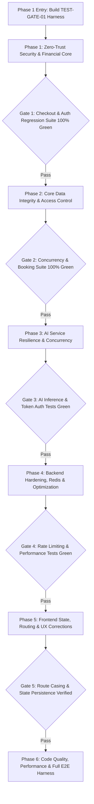

# Master Pre-Launch Implementation Plan: SVMB (DietOn / NutriPlatform)

This engineering implementation plan synthesizes the **Frontend/UI/UX Pre-Launch Audit** and the **Backend + AI Service Layer Pre-Launch Audit** for the Personalized Dietary Platform (SVMB / NutriPlatform / DietOn). 

Every single finding across both audits has been accounted for without omissions or silent deletions. True cross-cutting duplicates have been merged into unified entries (`CROSS-001` and `CROSS-002`), preserving original locations and descriptions from both layers.


---

## Plan Revisions & Additive Verification Changelog

Following rigorous codebase auditing against `frontend/`, `backend/nutriplatform/`, and `ai-service/food_api/`, the implementation plan was updated with the following verified amendments:

- **Item 1 (`TEST-GATE-01`, `CROSS-001`, `BE-008`)**: Widened Phase 1 test suite to include Stripe PaymentIntent validation (`test_stripe_payment_intent_creation`), Vitest smoke coverage for `payment.tsx` (`payment.smoke.test.tsx`), and formalized sequential serialization for `checkout_views.py` across `CROSS-001` (Phase 1) and `BE-008` (Phase 2). Clarified that client-side synchronous confirmation (`stripe.confirmCardPayment`) is used; asynchronous webhooks are deferred as unnecessary for this synchronous flow.
- **Item 2 (`BE-006`, `TEST-GATE-01`)**: Added `test_plan_progression.py` to `TEST-GATE-01` to capture the Day-7 premature completion baseline failure (`current_day_index >= duration - 1` in `client/views.py:540-548`) before applying the fix in Phase 2.
- **Item 3 (`BE-001`)**: Explicitly specified `.env.example` templates across all layers with strict variable partitioning: `STRIPE_SECRET_KEY` confined exclusively to backend, `NEXT_PUBLIC_STRIPE_PUBLISHABLE_KEY` confined to frontend, and documented a 90-day secret rotation cadence runbook.
- **Item 4 (`FE-012`)**: Appended PCI-DSS SAQ Scope Note documenting that Stripe Elements iframes reduce merchant audit liability from SAQ D to SAQ A / SAQ A-EP, highlighting that formal Attestation of Compliance (AoC) requires QSA/compliance officer sign-off.
- **Item 5 (`BE-018`)**: Upgraded Redis configuration to a dual-cache model (`"default"` on DB 1 with `IGNORE_EXCEPTIONS: True` fail-open; `"ratelimit"` on DB 2 with `IGNORE_EXCEPTIONS: False` fail-closed to prevent brute-force attacks during Redis outages without eviction collisions) and added ops health probe guidance.

---

## Process & Architectural Enhancements (Updated)

Following architectural and regulatory review, the rollout process and security posture have been fortified with four critical controls:

1. **Phase-Gated Regression & Shared-File Protection**:
   - `CROSS-001` (Plan purchase checkout rewrite) and `BE-008` (Consultation slot locking) both modify `backend/nutriplatform/marketplace/checkout_views.py`. To prevent cross-phase regressions, **Phase 1 now mandates writing an end-to-end checkout integration test suite (`test_checkout_integration.py`) BEFORE modifying `checkout_views.py`**.
   - Strict automated regression gates are established between phases: Phase N+1 cannot begin until all Phase N integration tests pass with 100% green status.
2. **Phase 1 Smoke & Integration Test Gate (Pulled Forward from FE-026)**:
   - Shipping payment, auth, and concurrency fixes into an untested codebase is unsafe. A targeted automated test gate covering **Authentication, Checkout, and Consultation Booking** is pulled forward into Phase 1 as an exit criterion. The broader UI component and Playwright E2E harness remains in Phase 6.
3. **Escalation of FE-012 to Critical (PCI-DSS Regulatory Compliance)**:
   - Mere FAQ copy updates do not resolve the legal and regulatory liabilities of capturing raw credit card numbers, CVVs, and expiry dates in React component state. `FE-012` is escalated to **Critical**, and the fix is upgraded: **complete elimination of raw card data from React state**, replacing custom card inputs with tokenized Stripe Elements (`@stripe/react-stripe-js`) or secure tokenization where only opaque tokens (`tok_...` / `pm_...`) touch the application.
4. **Redis Ops Runbook & Developer Verification (`BE-018`)**:
   - Acknowledges the developer's completed local setup (Ubuntu/WSL Redis server on port 6379, `redis`, `hiredis`). Incorporates developer configuration instructions, connection verification commands, graceful fallback for offline dev, and production deployment parameters (`allkeys-lru`, password authentication).

---

## Master Index

| ID | Area | Category | Severity | Title |
| :--- | :--- | :--- | :--- | :--- |
| **TEST-GATE-01** | Cross-cutting | QA & Safety Gate | **Critical** | Phase 1 Pre-Implementation Smoke & Integration Test Suite (Checkout, Auth, Booking) |
| **CROSS-001** | Cross-cutting | Security & Business Logic | **Critical** | Plan Purchase Checkout Security & Server-Side Price Verification (FE-1 / BE-3) |
| **CROSS-002** | Cross-cutting | Data Integrity & Persistence | **Critical** | End-to-End Review & Rating System Integrity (FE-2 / BE-7) |
| **FE-003** | Frontend | Functional Bug | **Critical** | Infinite 404 Request Loop on Missing `/placeholder-avatar.png` Fallback |
| **FE-004** | Frontend | Security & Architecture | **Critical** | Insecure Token Cookie Attributes & Missing Server-Side Refresh Token Invalidation |
| **FE-005** | Frontend | Environment & Config | **Critical** | Hardcoded Localhost API Base URL Overriding `.env.local` Configuration |
| **FE-012** | Frontend & Sec | Legal & Compliance | **Critical** | PCI-DSS Violation & Raw Card Data Capture: Full Migration to Tokenized Stripe Elements (Escalated) |
| **BE-001** | Backend & AI | Security & Secret Mgmt | **Critical** | Active Production Secrets and Database Credentials Committed to Repository `.env` |
| **BE-002** | Backend | Business Logic & Access | **Critical** | Direct Consultation Booking Bypass Circumventing Payment Flow Completely |
| **BE-005** | Backend | Portability & DevOps | **Critical** | Case-Sensitivity Crash (`urls.Py`) Breaking Linux & Docker Container Deployments |
| **AI-004** | AI Service | Security & RCE Vector | **Critical** | Unauthenticated Arbitrary File Overwrite & Path Traversal via `/segment/save` |
| **FE-006** | Frontend & BE | Data Persistence | **High** | Admin Global Subscription Pricing Persisted Exclusively in Browser `localStorage` |
| **FE-007** | Frontend | Authorization & Layout | **High** | Nutritionist Dashboard Layout Approval State Defaults to `"APPROVED"` Locally |
| **FE-008** | Frontend | Portability & Routing | **High** | Route Casing Mismatch on Client Invoice Page (`/client/Invoice` vs standard routing) |
| **FE-009** | Frontend | Functional Bug | **High** | Dead PDF Receipt and Earnings Statement Download Buttons with Missing Click Handlers |
| **FE-010** | Frontend & BE | Functional Bug | **High** | Blog Topic Category Filter Rendered Ineffective via Hardcoded `\|\| true` |
| **FE-011** | Frontend | Functional Bug | **High** | Meal Plan Day Completion Blocker for Meals with Zero or Multiple Snacks |
| **BE-006** | Backend | Business Logic | **High** | Premature Plan Completion Engine Drops Final Day (Day 7) of Purchased Plans |
| **BE-008** | Backend | Concurrency & Integrity | **High** | Slot Booking Race Condition Permitting Overlapping Practitioner Appointments |
| **BE-009** | Backend | Auth & Permissions | **High** | Pending and Rejected Nutritionists Issued Valid JWT Authentication Tokens |
| **BE-010** | Backend | Data Integrity | **High** | Non-Atomic User Registrations Leaving Orphaned User Records on Profile Failures |
| **AI-011** | AI Service | Performance & Concurrency | **High** | Synchronous ONNX Model Inference Freezing FastAPI Asyncio Event Loop |
| **AI-012** | AI Service | Reliability & DoS | **High** | Unbounded In-Memory File Uploads Enabling Out-of-Memory (OOM) Server Crashes |
| **AI-013** | AI Service | Security & Access Control | **High** | AI Vision Inference Endpoints Completely Unauthenticated and Publicly Exposed |
| **AI-014** | AI Service & BE | Security & Robustness | **High** | Chatbot System Prompt Injection Vulnerability and Raw Exception Leakage |
| **FE-013** | Frontend | Sloppy Implementation | **Medium** | Axios Service Path Inconsistency: Leading Slashes Stripping API Base URL Subpath |
| **FE-014** | Frontend | Reliability & Bug | **Medium** | Client Invoice Page Silently Injects Hardcoded Mock Data on Network Failure |
| **FE-015** | Frontend | UX Quality & Accessibility| **Medium** | Native Synchronous `confirm()` Dialogs Utilized for Irreversible Deletions |
| **FE-016** | Frontend | UX Quality & State | **Medium** | NutriBot Chatbot Conversation History Destroyed on Dashboard Route Changes |
| **FE-017** | Frontend | UX Quality & State | **Medium** | Daily Meal Checklist State Discarded Upon Navigation Between Days or Refresh |
| **FE-018** | Frontend | Accessibility & HTML Spec | **Medium** | Invalid HTML Element Nesting (Interactive `<button>` Inside `<a>` Anchor) |
| **FE-019** | Frontend | Sloppy Implementation | **Medium** | Deprecated Static Prototype Route Left Exposed at `/dashboard` |
| **FE-020** | Frontend | Code Smells & Hygiene | **Medium** | Zero-Byte Placeholder File (`src/lib/validators.ts`) Left in Source Tree |
| **FE-021** | Frontend | Code Smells & Security | **Medium** | Leftover Debugging `console.log` Calls Dumping Payloads During Static Generation |
| **BE-015** | Backend | Functional Bug | **Medium** | Admin User Deactivation Logic Inadvertently Unbans Client Accounts |
| **BE-016** | Backend | Performance & Scalability | **Medium** | Synchronous N+1 CalorieNinjas HTTP Calls Exhausting Gunicorn Worker Threads |
| **BE-017** | Backend | Input Validation | **Medium** | Negative Food Mass Allowed, Permitting Negative Calorie Tampering |
| **BE-018** | Backend | Scalability & Ops | **Medium** | Redis Distributed Rate Limiting, Cache Architecture & Ops Runbook |
| **BE-019** | Backend | Performance & Scalability | **Medium** | Unpaginated Admin User Endpoints Inducing Server Memory Spikes and Timeouts |
| **AI-020** | AI Service & BE | Reliability & Resilience | **Medium** | Hardcoded Single LLM Provider Lacking Request Timeouts and Fallback Circuit Breaker |
| **FE-022** | Frontend | Performance & Core Web Vitals | **Low** | Pervasive Use of Unoptimized Native `` Elements Instead of `next/image` |
| **FE-023** | Frontend | UI Quality | **Low** | Conflicting Tailwind Background Utility Classes on Services CTA Button |
| **FE-024** | Frontend | Accessibility | **Low** | Missing Accessible Names (`aria-label`) on Icon-Only Post Deletion Buttons |
| **FE-025** | Frontend | Bundle Size & Architecture| **Low** | Monolithic Client Components and Static Mock Fixtures Bundled in Production |
| **FE-026** | Frontend | Code Quality & QA | **Low** | Full Component & Playwright E2E Test Suite Rollout (Phase 6 Final Expansion) |

---

## Detailed Fix Entries

---

### Tier 1: Critical Severity

#### `[TEST-GATE-01] Phase 1 Pre-Implementation Smoke & Integration Test Suite — Critical — Cross-cutting`

- **Problem:**
  - The repository completely lacks automated tests (`FE-026`). Modifying critical financial transactions (`CROSS-001`), consultation booking (`BE-002`), slot concurrency (`BE-008`), and authentication (`FE-004`, `BE-009`) without baseline automated tests creates an unacceptably high risk of introducing silent regressions into normal checkout, user sign-in, or appointment booking.
  - Specifically, `CROSS-001` (Plan purchase checkout rewrite) in Phase 1 and `BE-008` (Consultation slot locking) in Phase 2 both modify `backend/nutriplatform/marketplace/checkout_views.py`. Modifying this file twice across different phases without an established integration test suite guarantees regressions.
- **Goal:**
  - Build and commit a focused backend integration test suite and frontend smoke test harness in Phase 1 *before* executing code changes on shared views.
  - Establish a hard quality gate: all tests must pass 100% green before any subsequent phase can be merged or deployed.
- **Implementation plan:**
  1. In `backend/nutriplatform/marketplace/tests/test_checkout_integration.py`:
     - Write integration tests using DRF's `APITestCase`:
       - `test_plan_checkout_session_creation`: Tests creating a session via `/api/marketplace/checkout/session/`.
       - `test_plan_checkout_confirmation_success`: Verifies normal valid plan purchase.
       - `test_consultation_checkout_session_creation`: Tests consultation session creation with slot metadata.
       - `test_legacy_plan_purchase_baseline`: Captures baseline behavior of `PlanPurchaseView`.
       - `test_stripe_payment_intent_creation`: Verifies backend initialization and server-side validation of Stripe PaymentIntents/tokens for unified checkout.
  2. In `backend/nutriplatform/client/tests/test_plan_progression.py`:
     - Write unit/integration tests for plan day advancement (`BE-006`):
       - `test_day_7_advancement_baseline`: Captures the off-by-one behavior where day index 6 of a 7-day plan improperly triggers premature completion, establishing the regression baseline prior to Phase 2 fixes.
  3. In `backend/nutriplatform/users/tests/test_auth_integration.py`:
     - Test login for Client, Nutritionist, and Admin.
     - Test token refresh and verify logout blacklisting behavior.
  4. In `frontend/`:
     - Install Vitest: `npm install -D vitest @testing-library/react @testing-library/jest-dom jsdom`.
     - Write smoke tests in `src/lib/auth.test.ts` (cookie parsing, token extraction) and `src/lib/payment.test.ts` (context parsing).
     - Write component smoke test in `src/components/payment.smoke.test.tsx` verifying that `payment.tsx` renders Stripe `<Elements>` container, handles card tokenization triggers, and avoids placing raw card data into component state.
  5. **Verification:**
     - Run `python manage.py test marketplace.tests.test_checkout_integration users.tests.test_auth_integration client.tests.test_plan_progression` and `npm run test`; verify all baseline tests pass.
- **Dependencies / sequencing:**
  - Must be completed in Phase 1 BEFORE executing `CROSS-001`, `BE-002`, or `FE-004`.
  - **Shared-File Serialization Rule**: `backend/nutriplatform/marketplace/checkout_views.py` is modified by both `CROSS-001` (Phase 1) and `BE-008` (Phase 2). All `test_checkout_integration.py` tests must pass 100% green before `CROSS-001` starts, after `CROSS-001` merges, and again before and after `BE-008` is executed.

---

#### `[CROSS-001] Plan Purchase Checkout Security & Server-Side Price Verification — Critical — Cross-cutting`

- **Problem:**
  - *Frontend Audit Finding #1 (`src/lib/payment.ts#L89-L130`, `src/components/payment.tsx#L462-L484`):* The checkout flow transmits the purchase price (`amount`) via URL search parameters (`params.set("amount", String(input.amount))`), and `parsePaymentContext` extracts `rawAmount` directly from the URL. In `payment.tsx`:
    ```ts
    await purchaseMarketplacePlan(legacyContext.planId, {
      transaction_number: generatedTransactionNumber,
      amount_paid: summary.amount, // Derived directly from URL query param
    });
    ```
    An attacker can manipulate the URL to `?amount=0.01` and submit a valid purchase for 1 cent. Additionally, transaction IDs are fabricated entirely client-side using `Math.random()`:
    ```ts
    export function generateTransactionNumber(prefix: string): string {
      const random = Math.random().toString(36).slice(2, 8).toUpperCase();
      return `${normalizedPrefix}-${Date.now()}-${random}`;
    }
    ```
  - *Backend Audit Finding #3 (`backend/nutriplatform/marketplace/views.py:107-196`):* In `PlanPurchaseView.post`, the view takes `amount_paid` directly from the client JSON payload:
    ```python
    amount_paid = serializer.validated_data['amount_paid']
    transaction_number = serializer.validated_data['transaction_number']
    purchase = Purchase.objects.create(
        client=client, plan=plan, amount_paid=amount_paid, ...
    )
    ```
    The endpoint never asserts that `Decimal(str(amount_paid)) == Decimal(str(plan.price))` and blindly creates an active `UserPlan` granting full access.
- **Goal:**
  - Eliminate client-controlled purchase prices and client-generated transaction IDs.
  - The backend server is the sole authority for price calculation derived directly from `plan.price`.
  - Discontinue the legacy payment route or enforce strict server-side validation rejecting any `amount_paid != plan.price`. All payments route through `UnifiedCheckoutSessionView` (`/marketplace/checkout/session/`) and `CheckoutSessionConfirmView`.
- **Implementation plan:**
  1. Ensure `test_checkout_integration.py` (`TEST-GATE-01`) is committed and passing.
  2. In `backend/nutriplatform/marketplace/views.py` (`PlanPurchaseView.post`):
     - Deprecate client-supplied `amount_paid`.
     - Force `amount_paid = plan.price`.
     - Add explicit assertion: if `request.data.get('amount_paid')` is passed, verify `Decimal(str(request.data['amount_paid'])) == Decimal(str(plan.price))`. If mismatched, return HTTP 400 (`PRICE_TAMPERING_DETECTED`).
  3. In `backend/nutriplatform/marketplace/serializers.py` (`PurchasePlanSerializer`):
     - Make `amount_paid` read-only or optional.
     - Validate that `transaction_number` conforms to verified checkout sessions generated by the backend gateway.
  4. In `frontend/src/lib/payment.ts`:
     - Deprecate `generateTransactionNumber()`.
     - Remove `amount` from `buildPaymentUrl` query string generation for plans. Transmit only `planId` or `checkout_id`.
  5. In `frontend/src/components/payment.tsx`:
     - Refactor checkout submission to initiate an authentic checkout session via `createCheckoutSession({ item_type: 'MEAL_PLAN', item_id: planId })`.
     - Pass only the `checkout_id` received from the server to `confirmCheckoutSession`.
  6. **Verification:**
     - Run `python manage.py test marketplace.tests.test_checkout_integration`.
     - Attempt sending a `POST /api/marketplace/plans/<id>/purchase/` with payload `{"amount_paid": 0.01}`; verify HTTP 400 is returned.
     - Complete a purchase through the Next.js UI; verify `UserPlan` and `Purchase` records in the database reflect the exact plan price configured in the database.
- **Dependencies / sequencing:**
  - Gated by `TEST-GATE-01`. Must be deployed before or simultaneously with frontend checkout refactoring.
  - **Shared-File Serialization**: Modifies `backend/nutriplatform/marketplace/checkout_views.py`. `test_checkout_integration.py` from `TEST-GATE-01` must pass before modifying this file, and again after completion, establishing the verified baseline before `BE-008` touches `checkout_views.py` in Phase 2.

---

#### `[FE-012] PCI-DSS Violation & Raw Card Data Capture: Full Migration to Tokenized Stripe Elements — Critical — Frontend & Security (Escalated from High)`

- **Problem:**
  - *Frontend Audit Finding #12 (`src/components/subscription/subscription.tsx#L70-L73`, `src/components/payment.tsx#L350-L450`, `src/lib/payment.ts`):* The finding originally noted misleading FAQ claims ("We use industry-standard 256-bit encryption and partner with top-tier payment processors like Stripe. Your credit card details are never stored on our servers...").
  - However, the underlying architectural defect is far more severe than misleading copy: `src/components/payment.tsx` renders custom text inputs capturing raw Primary Account Numbers (PAN), expiration dates, and Card Verification Values (CVV) directly into unencrypted React component state (`cardNumber`, `cvv`, `expiryDate`).
  - Handling, capturing, or transmitting un-tokenized PANs directly violates PCI-DSS Level 1–4 compliance standards, subjecting the platform to immense legal liability, card brand fines, and revocation of merchant privileges. Rewriting the FAQ to state that the app captures raw cards does not resolve the regulatory illegality of collecting raw card data.
- **Goal:**
  - Escalate finding severity from High to **Critical**.
  - Completely eliminate raw credit card number, CVV, and expiry fields from React component state and frontend memory.
  - Implement client-side tokenization via **Stripe Elements** (`@stripe/react-stripe-js` / `@stripe/stripe-js`) or secure iframe tokenization. The platform's application code and memory must never touch or store raw PAN or CVV.
  - **PCI-DSS SAQ Scope Note**: Delegating card data collection exclusively to Stripe Elements iframes isolates cardholder data from our infrastructure. Because the application server and client JavaScript never process, transmit, or store cardholder data (PAN/CVV), the organization reduces its PCI-DSS compliance footprint from SAQ D to **SAQ A** (or **SAQ A-EP** depending on specific iframe hosting attributes). *Formal PCI-DSS scope validation and Attestation of Compliance (AoC) must be reviewed and signed off by the organization's Qualified Security Assessor (QSA) or compliance officer.*
  - **Synchronous Confirmation Architecture**: The checkout model in `payment.tsx` operates synchronously: `stripe.confirmCardPayment(...)` (or `stripe.createPaymentMethod(...)`) handles authentication/3DS client-side and returns a PaymentIntent ID (`pi_...`), which the frontend immediately submits to `confirmCheckoutSession` on the backend for server verification. Asynchronous Stripe webhooks are not required for this synchronous checkout flow.
- **Implementation plan:**
  1. In `frontend/package.json`: install `@stripe/stripe-js` and `@stripe/react-stripe-js`.
  2. In `frontend/src/components/payment.tsx`:
     - Delete all React state holding raw card credentials (`cardNumber`, `expiryDate`, `cvv`, `nameOnCard`).
     - Replace custom card inputs with Stripe `<Elements>` and `<CardElement>` (or `<PaymentElement>`), initialized with `NEXT_PUBLIC_STRIPE_PUBLISHABLE_KEY`.
     - During payment confirmation, invoke `stripe.createPaymentMethod(...)` or `stripe.confirmCardPayment(...)`. Stripe's SDK securely tokenizes card data directly against Stripe's PCI-compliant vaults, returning a safe, opaque payment method ID (`pm_...`) or token (`tok_...`).
     - Transmit only the opaque payment method ID or token alongside `checkout_id` to the backend.
     - For offline sandbox testing when live Stripe keys are not provisioned, provide a tokenized Sandbox Selector (e.g. pre-configured "Test Visa 4242", "Test Mastercard 5555" buttons) that injects verified test tokens without allowing manual raw PAN entry.
  3. In `frontend/src/components/subscription/subscription.tsx` (lines 70–73):
     - Update FAQ copy to accurately reflect the active tokenized architecture:
       > "We use industry-standard 256-bit encryption and process payments through PCI-DSS Level 1 certified payment processors like Stripe. Your raw credit card details are tokenized client-side and never touch or reside on our servers, ensuring bank-level security for every transaction."
  4. **Verification:**
     - Inspect the React DevTools component tree during checkout: verify that no state variable contains a 16-digit card number or 3-digit CVV.
     - Inspect the browser Network tab: verify that the request payload to the backend contains only `{ payment_method_id: "pm_...", checkout_id: "..." }`.
- **Dependencies / sequencing:**
  - Must be implemented in Phase 1 alongside `CROSS-001`.

---

#### `[CROSS-002] End-to-End Review & Rating System Integrity — Critical — Cross-cutting`

- **Problem:**
  - *Frontend Audit Finding #2 (`src/lib/localRatings.ts#L1-L103`, `src/components/ReviewModal.tsx#L46-L51`, `src/components/PlanMarketplace.tsx#L95-L96`, `src/components/choosenutritionist.tsx#L316-L317`):* Review submissions write ratings into `localStorage` under `pdp_local_ratings`. `localRatings.ts` exports `mergeRating`, which averages API ratings with local browser ratings. Every plan and nutritionist card modifies displayed ratings based on local storage, allowing trivial client-side rating spoofing in DevTools.
  - *Backend Audit Finding #7 (`backend/nutriplatform/client/views.py:619-710`):* In `ServiceReviewView.post`, there is no uniqueness check on `(client, item_type, item_id)`. Any client who has completed a consultation or purchased a plan can loop POST requests, creating thousands of reviews for the same service. Every review immediately modifies `nutritionist.rating` and `nutritionist.reviews_count` via incremental arithmetic, enabling malicious competitors or disgruntled users to drive practitioner ratings to 1.0.
- **Goal:**
  - Completely purge `src/lib/localRatings.ts` and remove all local storage rating manipulation from the frontend.
  - Frontend renders ratings exclusively from backend API responses.
  - Enforce a database-level uniqueness constraint restricting clients to exactly one review per finished consultation or purchased plan.
  - Recalculate practitioner ratings idempotently using database aggregation (`Avg('rating')`).
- **Implementation plan:**
  1. In `backend/nutriplatform/client/models.py` (`ServiceReview.Meta`):
     - Add `unique_together = ('client', 'item_type', 'item_id')` (or `models.UniqueConstraint(fields=['client', 'item_type', 'item_id'], name='unique_client_service_review')`).
  2. Execute `python manage.py makemigrations client` and `python manage.py migrate`.
  3. In `backend/nutriplatform/client/views.py` (`ServiceReviewView.post`):
     - Before creation, check `if ServiceReview.objects.filter(client=client, item_type=item_type, item_id=item_id).exists(): return Response({"status": "error", "message": "You have already reviewed this service.", "code": "ALREADY_REVIEWED"}, status=409)`.
     - Replace incremental arithmetic with atomic aggregation:
       ```python
       reviews = ServiceReview.objects.filter(nutritionist=nutritionist)
       agg = reviews.aggregate(avg=Avg('rating'), count=Count('id'))
       nutritionist.rating = round(agg['avg'] or 0.0, 2)
       nutritionist.reviews_count = agg['count']
       nutritionist.save(update_fields=['rating', 'reviews_count'])
       ```
  4. In `frontend/src/lib/localRatings.ts`:
     - Delete `src/lib/localRatings.ts` using `git rm`.
  5. In `frontend/src/components/ReviewModal.tsx`, `PlanMarketplace.tsx`, and `choosenutritionist.tsx`:
     - Remove all imports of `localRatings.ts` (`mergeRating`, `getLocalRatings`, `saveLocalRating`).
     - Directly render `plan.rating_avg` and `nutri.rating` from the API payload.
     - In `ReviewModal.tsx`, upon successful review submission, invoke an `onSuccess` callback to refetch authentic profile data from the server.
  6. **Verification:**
     - Attempt to post two consecutive reviews for the same consultation ID; verify the second attempt returns HTTP 409.
     - Verify modified `localStorage` keys have zero effect on rendered ratings in the browser.
- **Dependencies / sequencing:**
  - Backend migration must be applied prior to deploying the frontend refactor.

---

#### `[FE-003] Infinite 404 Request Loop on Missing /placeholder-avatar.png Fallback — Critical — Frontend`

- **Problem:**
  - *Frontend Audit Finding #3 (`src/components/choosenutritionist.tsx#L326-L344`, `src/components/NutritionistProfileModal.tsx#L75`, `src/components/scheduleconsultation.tsx#L79`):* When a practitioner lacks a profile photo, `avatarSrc` defaults to `"/placeholder-avatar.png"`. In addition, `onError` executes:
    ```tsx
    onError={(e) => {
      (e.currentTarget as HTMLImageElement).src = "/placeholder-avatar.png";
    }}
    ```
    Because `/public/placeholder-avatar.png` does not exist in `/public`, loading the image returns a 404. The `onError` handler fires and re-assigns `src` to the same missing path, triggering an infinite recursive storm of 404 HTTP requests that burns CPU cycles and freezes the user's browser tab.
- **Goal:**
  - Place a lightweight, valid fallback image asset at `frontend/public/placeholder-avatar.png`.
  - Guard all `onError` handlers across the application with `e.currentTarget.onerror = null` before reassigning fallback sources.
- **Implementation plan:**
  1. Add a valid, optimized PNG/SVG avatar fallback asset to `frontend/public/placeholder-avatar.png`.
  2. In `frontend/src/components/choosenutritionist.tsx` (lines 340–343):
     ```tsx
     onError={(e) => {
       const target = e.currentTarget as HTMLImageElement;
       target.onerror = null;
       target.src = "/placeholder-avatar.png";
     }}
     ```
  3. In `frontend/src/components/NutritionistProfileModal.tsx` (line 75) and `src/components/scheduleconsultation.tsx` (line 79), implement the identical `target.onerror = null` guard.
  4. **Verification:**
     - In DevTools Network tab, simulate a broken image URL for a nutritionist card; confirm that exactly one fallback request is made, the default avatar renders, and no recursive requests occur.
- **Dependencies / sequencing:** None.

---

#### `[FE-004] Insecure Token Cookie Attributes & Missing Server-Side Refresh Token Invalidation — Critical — Frontend`

- **Problem:**
  - *Frontend Audit Finding #4 (`src/lib/auth.ts#L31-L41`, `src/components/dashboard/shared/UserProfileDropdown.tsx#L146-L154`):* `setAccessToken` and `setRefreshToken` set JWT tokens via `document.cookie` without `SameSite`, `Secure`, or `HttpOnly` flags. Any malicious script or XSS vector can steal access and refresh tokens. Furthermore, `clearAuthSession` merely wipes local cookies and removes `dieton_user` from `localStorage`. It never calls the backend logout endpoint (`/api/users/logout/`), leaving the 7-day refresh token valid on the server even after user sign-out.
- **Goal:**
  - Harden cookie attributes (`SameSite=Lax`, `Secure` when on HTTPS).
  - Update `clearAuthSession` to call `POST /api/users/logout/` with the refresh token to blacklist it in SimpleJWT before purging client state.
- **Implementation plan:**
  1. Verify backend `users/urls.py` exposes `LogoutView` backed by `LogoutSerializer` (which calls `RefreshToken(token).blacklist()`).
  2. In `frontend/src/lib/auth.ts`:
     - Update `setAccessToken` and `setRefreshToken` to append `; SameSite=Lax` and `; Secure` (if `window.location.protocol === 'https:'`).
     - Update `clearAuthSession`:
       ```ts
       export async function clearAuthSession(callServerLogout: boolean = true) {
         if (callServerLogout && typeof document !== "undefined") {
           const refresh = getCookie("refresh_token");
           if (refresh) {
             try {
               await fetch(`${API_BASE_URL}users/logout/`, {
                 method: "POST",
                 headers: { "Content-Type": "application/json" },
                 body: JSON.stringify({ refresh }),
               });
             } catch (err) {
               console.error("Failed to revoke token on server:", err);
             }
           }
         }
         if (typeof document !== "undefined") {
           document.cookie = "access_token=; path=/; max-age=0; SameSite=Lax";
           document.cookie = "refresh_token=; path=/; max-age=0; SameSite=Lax";
           document.cookie = "user_role=; path=/; max-age=0; SameSite=Lax";
         }
         if (typeof window !== "undefined") {
           window.localStorage.removeItem(SESSION_USER_KEY);
         }
       }
       ```
  3. In `frontend/src/components/dashboard/shared/UserProfileDropdown.tsx` (lines 146–154):
     - Update `handleLogout` to `await clearAuthSession(true)` before navigating to `/login`.
  4. **Verification:**
     - Sign in to obtain tokens, then click "Log out".
     - Copy the refresh token before logout; after logout, attempt to call `POST /api/users/token/refresh/` with that token; verify SimpleJWT responds with HTTP 401 (`Token is blacklisted`).
- **Dependencies / sequencing:**
  - Verify `rest_framework_simplejwt.token_blacklist` is installed in Django `INSTALLED_APPS`.

---

#### `[FE-005] Hardcoded Localhost API Base URL Overriding .env.local Configuration — Critical — Frontend`

- **Problem:**
  - *Frontend Audit Finding #5 (`src/lib/api.ts#L4`, `src/app/api/marketplace/plans/[id]/preview/route.ts#L3`):* `.env.local` defines `NEXT_PUBLIC_API_URL=http://localhost:5000/api`. However, `src/lib/api.ts` line 4 hardcodes `export const API_BASE_URL = "http://127.0.0.1:8000/api/v1/";`. `NEXT_PUBLIC_API_URL` is never referenced anywhere in `src/`. Similarly, the Next.js API preview route hardcodes `http://127.0.0.1:8000/api/v1/`. Deploying to Docker, staging, QA, or production immediately breaks network communications because the frontend attempts to call `127.0.0.1:8000`.
- **Goal:**
  - Bind `API_BASE_URL` dynamically to `process.env.NEXT_PUBLIC_API_URL`, with fallback to `http://127.0.0.1:8000/api/v1/` for local development.
  - Standardize `.env.local` and `.env.example` across the repository.
- **Implementation plan:**
  1. In `frontend/src/lib/api.ts` (line 4):
     ```ts
     const rawUrl = process.env.NEXT_PUBLIC_API_URL || "http://127.0.0.1:8000/api/v1/";
     export const API_BASE_URL = rawUrl.endsWith("/") ? rawUrl : `${rawUrl}/`;
     ```
  2. In `frontend/src/app/api/marketplace/plans/[id]/preview/route.ts` (line 3):
     - Import `API_BASE_URL` from `@/lib/api` instead of hardcoding `http://127.0.0.1:8000/api/v1/`.
  3. In `frontend/.env.local` and `frontend/.env.example`:
     - Update `NEXT_PUBLIC_API_URL=http://127.0.0.1:8000/api/v1/` to match the actual Django API root path.
  4. **Verification:**
     - Build the Next.js app with `NEXT_PUBLIC_API_URL=https://staging.nutriplatform.com/api/v1/`; verify in DevTools network inspection that all outgoing requests target the staging domain.
- **Dependencies / sequencing:**
  - Must precede any container build or staging deployment.

---

#### `[BE-001] Active Production Secrets and Database Credentials Committed to Repository .env — Critical — Backend & AI`

- **Problem:**
  - *Backend Audit Finding #1 (`backend/nutriplatform/.env`, `ai-service/food_api/.env`):* Active production credentials including `GROQ_API_KEY` (`gsk_6F...`), `CALORIE_NINJAS_KEY` (`4YVX...`), Django `SECRET_KEY`, and PostgreSQL database passwords (`DB_PASSWORD=5F36D1`) are committed directly into version control. Any collaborator, contractor, or repository leak exposes database records and paid third-party API quotas.
- **Goal:**
  - Revoke and rotate all committed keys immediately.
  - Untrack `.env` files from Git while preserving local development workflows via `.env.example` templates.
  - Enforce `.env*` exclusion in root and subproject `.gitignore` files.
- **Implementation plan:**
  1. Immediately log into Groq Console and CalorieNinjas dashboards and revoke the committed API keys. Generate new keys.
  2. In PostgreSQL, alter the password for the database user.
  3. Remove tracked `.env` files from git history:
     ```bash
     git rm --cached backend/nutriplatform/.env
     git rm --cached ai-service/food_api/.env
     ```
  4. Update `backend/nutriplatform/.gitignore`, `ai-service/food_api/.gitignore`, and root `.gitignore`:
     ```gitignore
     .env
     .env.local
     .env.*.local
     *.env
     ```
  5. Create sanitized `.env.example` template files across all tiers with strict secret boundary separation:
      - `backend/nutriplatform/.env.example`:
        ```env
        SECRET_KEY=
        DEBUG=False
        DB_NAME=nutriplatform_db
        DB_USER=nutriplatform_user
        DB_PASSWORD=
        DB_HOST=127.0.0.1
        DB_PORT=5432
        GROQ_API_KEY=
        CALORIE_NINJAS_KEY=
        REDIS_URL=redis://127.0.0.1:6379/1
        AI_SERVICE_SECRET_KEY=
        STRIPE_SECRET_KEY=
        STRIPE_WEBHOOK_SECRET=
        ```
        *(CRITICAL: `STRIPE_SECRET_KEY` must strictly reside on the backend and NEVER be committed or exposed to the frontend).*
      - `frontend/.env.example`:
        ```env
        NEXT_PUBLIC_API_URL=http://127.0.0.1:8000/api/v1/
        NEXT_PUBLIC_STRIPE_PUBLISHABLE_KEY=
        ```
        *(CRITICAL: Never declare `STRIPE_SECRET_KEY` or non-public variables here; only publishable public keys with `NEXT_PUBLIC_` prefix are permitted).*
      - `ai-service/food_api/.env.example`:
        ```env
        AI_SERVICE_SECRET_KEY=
        CALORIE_NINJAS_KEY=
        ```
  6. Generate a new cryptographically random Django `SECRET_KEY` in the local untracked `.env`.
  7. **Key Provisioning & Rotation Runbook**:
      - For production deployments, provision Stripe keys directly from the Stripe Dashboard (Developers -> API keys -> Restricted Secret Keys with least-privilege permissions for Charges/PaymentIntents).
      - Store secrets in cloud secret stores (AWS Secrets Manager, GCP Secret Manager, or HashiCorp Vault) injected as environment variables at container startup.
      - Maintain a 90-day rotation cadence: generate new secondary keys in provider dashboards, deploy configuration, verify green health, and revoke old keys.
  8. **Verification:**
      - Run `git status`; verify `.env` files do not appear as tracked or modified files.
      - Check frontend bundle analysis (`npm run build`) to ensure zero instances of `STRIPE_SECRET_KEY` or database credentials exist in emitted client JavaScript chunks.
- **Dependencies / sequencing:**
  - Must be executed immediately before publishing or merging any commits.

---

#### `[BE-002] Direct Consultation Booking Bypass Circumventing Payment Flow Completely — Critical — Backend`

- **Problem:**
  - *Backend Audit Finding #2 (`backend/nutriplatform/client/views.py:237-378`):* In `ConsultationBookView.post`, a client submits `nutritionist_id`, `appointment_date`, `start_time`, `end_time`, `session_type`, and `notes`. The view validates slot availability and immediately calls:
    ```python
    Consultation.objects.create(
        client=client, nutritionist=nutritionist, status='upcoming', ...
    )
    ```
    It creates a confirmed appointment without requiring payment, validating an invoice, or verifying a completed checkout session. Any registered user can call `POST /api/client/consultations/book/` and receive free private consultations.
- **Goal:**
  - Deprecate direct appointment confirmation via `ConsultationBookView`.
  - Enforce that all consultation bookings initiate a checkout session via `UnifiedCheckoutSessionView` (`item_type='CONSULTATION'`).
  - Transition appointments to confirmed status exclusively inside `CheckoutSessionConfirmView` upon verified payment.
- **Implementation plan:**
  1. In `backend/nutriplatform/client/views.py` (`ConsultationBookView`):
     - Replace direct creation with an endpoint deprecation response:
       ```python
       return Response({
           "status": "error",
           "message": "Direct booking is deprecated. Please initiate booking through /api/marketplace/checkout/session/.",
           "code": "CHECKOUT_REQUIRED"
       }, status=status.HTTP_400_BAD_REQUEST)
       ```
  2. In `backend/nutriplatform/marketplace/checkout_views.py`:
     - Ensure `UnifiedCheckoutSessionView` handles `item_type='CONSULTATION'`, locking in `nutritionist.consultation_price`.
     - In `_confirm_consultation`, create the `Consultation` record only after payment validation inside `transaction.atomic()`.
  3. In `frontend/src/components/scheduleconsultation.tsx` and `frontend/src/lib/client/service.ts`:
     - Update consultation scheduling to call `createCheckoutSession` and redirect to the checkout flow.
  4. **Verification:**
     - Submit `POST /api/client/consultations/book/`; verify HTTP 400 `CHECKOUT_REQUIRED` is returned and no `Consultation` row is inserted.
- **Dependencies / sequencing:**
  - Coordinates with `BE-008` (Slot Booking Concurrency).

---

#### `[BE-005] Case-Sensitivity Crash (urls.Py) Breaking Linux & Docker Container Deployments — Critical — Backend`

- **Problem:**
  - *Backend Audit Finding #5 (`backend/nutriplatform/community/urls.Py`):* In the `community` app, the routing file is named `urls.Py` with a capital `P`. In `nutriplatform/urls.py`, the path is registered as `path('api/community/', include('community.urls'))`. On Windows NTFS filesystems (case-insensitive), this resolves, but on Linux production servers and Docker containers, Python fails with `ModuleNotFoundError: No module named 'community.urls'`, crashing server startup.
- **Goal:**
  - Rename `backend/nutriplatform/community/urls.Py` to lowercase `urls.py` in Git.
- **Implementation plan:**
  1. Use Git to perform a case-sensitive file rename:
     ```bash
     git mv backend/nutriplatform/community/urls.Py backend/nutriplatform/community/urls_temp.py
     git mv backend/nutriplatform/community/urls_temp.py backend/nutriplatform/community/urls.py
     ```
  2. Commit the change and verify `git ls-files` shows `backend/nutriplatform/community/urls.py`.
  3. **Verification:**
     - Test running `python manage.py check` inside a Linux Docker container or WSL environment; confirm no `ModuleNotFoundError` is raised.
- **Dependencies / sequencing:** None.

---

#### `[AI-004] Unauthenticated Arbitrary File Overwrite & Path Traversal via /segment/save — Critical — AI Service`

- **Problem:**
  - *Backend Audit Finding #4 (`ai-service/food_api/app.py:462-485`):* The `/segment/save` endpoint takes `output_path: str = Query("output/segmented.jpg")` directly from query parameters without sanitization:
    ```python
    @app.post("/segment/save")
    async def segment_save(file: UploadFile = File(...), output_path: str = Query("output/segmented.jpg")):
        ...
        Path(output_path).parent.mkdir(parents=True, exist_ok=True)
        cv2.imwrite(output_path, vis)
    ```
    An unauthenticated attacker can supply path traversal payloads (e.g., `../../etc/cron.d/malicious` or relative server script paths) to overwrite critical system files with OpenCV image output.
- **Goal:**
  - Permanently remove the `/segment/save` endpoint from `ai-service/food_api/app.py`.
  - Stream image previews in memory via `/segment/image` without writing anything to the server filesystem.
- **Implementation plan:**
  1. In `ai-service/food_api/app.py`:
     - Delete the entire `@app.post("/segment/save")` endpoint and function `segment_save` (lines 462–485).
  2. In `ai-service/food_api/app.py` (`segment_image`):
     - Ensure the binary preview endpoint streams JPEG bytes via `StreamingResponse(io.BytesIO(buffer), media_type="image/jpeg")` in memory without touching disk.
  3. Verify no frontend or backend services reference `/segment/save`.
  4. **Verification:**
     - Send a POST request to `http://127.0.0.1:8001/segment/save`; verify the server returns HTTP 404 Not Found.
- **Dependencies / sequencing:** None.

---

### Tier 2: High Severity

#### `[FE-006] Admin Global Subscription Pricing Persisted Exclusively in Browser localStorage — High — Frontend & Backend`

- **Problem:**
  - *Frontend Audit Finding #6 (`src/app/(main)/(dashboards)/admin/subscriptions/page.tsx#L46-L62`, `src/lib/payment.ts#L72-L87`):* In `AdminSubscriptionsPage`, saving prices executes `localStorage.setItem("admin_subscription_prices", JSON.stringify(pricesToSave));`. The description promises global updates for all new subscribers, but the changes exist solely in that specific administrator's browser storage. Normal users and other browsers see hardcoded defaults ($9.99/mo, $89.99/yr).
- **Goal:**
  - Implement a persistent database model and DRF endpoints for global subscription pricing (`GET/PUT /api/admin/subscriptions/pricing/` and public read `/api/client/subscriptions/pricing/`).
  - Wire frontend admin and subscription checkout pages to consume authoritative pricing from these endpoints.
- **Implementation plan:**
  1. In `backend/nutriplatform/admin_panel/models.py` (or `client/models.py`):
     - Create `SubscriptionTierPricing` model:
       ```python
       class SubscriptionTierPricing(models.Model):
           tier_code = models.CharField(max_length=50, unique=True) # 'pro_monthly', 'pro_yearly'
           display_name = models.CharField(max_length=100)
           price = models.DecimalField(max_digits=8, decimal_places=2)
           billing_cycle = models.CharField(max_length=20, choices=[('monthly', 'Monthly'), ('yearly', 'Yearly')])
           updated_at = models.DateTimeField(auto_now=True)
       ```
  2. Run `python manage.py makemigrations` and `python manage.py migrate`.
  3. In `backend/nutriplatform/admin_panel/views.py`:
     - Implement `AdminSubscriptionPricingView(APIView)` with `GET` and `PUT` methods (`permission_classes = [IsAuthenticated, IsAdmin]`).
     - Expose public endpoint `ClientSubscriptionPricingView(APIView)` for client checkout.
  4. In `frontend/src/app/(main)/(dashboards)/admin/subscriptions/page.tsx`:
     - Fetch initial pricing via `api.get("admin/subscriptions/pricing/")`.
     - On save, submit `api.put("admin/subscriptions/pricing/", updatedPrices)` and display success toast.
  5. In `frontend/src/lib/payment.ts` and `src/components/subscription/subscription.tsx`:
     - Replace `localStorage` fallbacks with dynamic fetching from `client/subscriptions/pricing/`.
  6. **Verification:**
     - Update yearly price to $99.00 in the admin dashboard. Open an incognito browser window as a client; verify `/client/subscription` displays $99.00.
- **Dependencies / sequencing:**
  - Backend endpoints must be deployed before updating frontend components.

---

#### `[FE-007] Nutritionist Dashboard Layout Approval State Defaults to "APPROVED" Locally — High — Frontend`

- **Problem:**
  - *Frontend Audit Finding #7 (`src/app/(main)/(dashboards)/nutritionist/layout.tsx#L54`):* The layout manages practitioner approval status via `const [approvalStatus, setApprovalStatus] = useState<"APPROVED" | "ACCOUNT_PENDING_APPROVAL">("APPROVED");`. It never calls `/api/nutritionist/profile/` to determine the user's real status. Defaulting to `"APPROVED"` renders the full dashboard and patient navigation. The pending state is only triggered if an unapproved user clicks a DevTools override button.
- **Goal:**
  - Fetch real approval status from `/api/nutritionist/profile/` upon layout mount.
  - If `approval_status !== 'approved'`, render the "Account Pending Verification" (or Rejected) screen and suppress patient routes.
- **Implementation plan:**
  1. In `frontend/src/app/(main)/(dashboards)/nutritionist/layout.tsx`:
     - Add `isLoading` state and an `useEffect` invoking `getNutritionistProfile()`.
     - Read `profile.approval_status`:
       - If `'pending'`, set `approvalStatus = "ACCOUNT_PENDING_APPROVAL"`.
       - If `'rejected'`, render rejection details including `profile.rejection_reason`.
       - If `'approved'`, set `approvalStatus = "APPROVED"`.
     - While fetching, render a centered loading spinner skeleton to prevent layout flicker.
  2. **Verification:**
     - Log in as a newly registered nutritionist with `approval_status = 'pending'`; verify the dashboard immediately displays the "Account Pending Verification" banner and hides patient data.
- **Dependencies / sequencing:**
  - Coordinates with `BE-009` (Backend Approval Checks).

---

#### `[FE-008] Route Casing Mismatch on Client Invoice Page (/client/Invoice vs standard routing) — High — Frontend`

- **Problem:**
  - *Frontend Audit Finding #8 (`src/app/(main)/(dashboards)/client/Invoice/page.tsx`, `src/app/(main)/(dashboards)/client/layout.tsx#L42`):* The directory is named `Invoice` with an uppercase `I`, and sidebar navigation links to `/client/Invoice`. On Windows filesystems, this resolves, but in case-sensitive Linux server environments (Docker, Vercel, AWS), navigating to `/client/invoices` or `/client/invoice` causes a 404 error. All other dashboard routes use lowercase kebab-case.
- **Goal:**
  - Rename the folder to standard lowercase `src/app/(main)/(dashboards)/client/invoices`.
  - Update navigation links in `client/layout.tsx` to `/client/invoices`.
- **Implementation plan:**
  1. Rename the directory using Git:
     ```bash
     git mv "src/app/(main)/(dashboards)/client/Invoice" "src/app/(main)/(dashboards)/client/invoices_temp"
     git mv "src/app/(main)/(dashboards)/client/invoices_temp" "src/app/(main)/(dashboards)/client/invoices"
     ```
  2. In `src/app/(main)/(dashboards)/client/layout.tsx` (line 42):
     - Update `url: "/client/Invoice"` to `url: "/client/invoices"`.
  3. Scan repository for any stray references to `/client/Invoice` and update them.
  4. **Verification:**
     - Build the Next.js app in a Linux container; navigate to `/client/invoices` and verify the page loads with HTTP 200.
- **Dependencies / sequencing:** None.

---

#### `[FE-009] Dead PDF Receipt and Earnings Statement Download Buttons with Missing Click Handlers — High — Frontend`

- **Problem:**
  - *Frontend Audit Finding #9 (`src/app/(main)/(dashboards)/client/Invoice/page.tsx#L402-L406`, `src/app/(main)/(dashboards)/nutritionist/earnings/page.tsx#L697-L701`):* In both the Client Invoice Details modal and the Nutritionist Earnings modal, the primary call-to-action button ("Download PDF Receipt" / "Download Statement") contains shimmer CSS animations and download icons, but completely lacks an `onClick` handler or `<a download>` attribute. Clicking the button does nothing.
- **Goal:**
  - Implement functional client-side receipt/statement PDF generation or browser print handlers.
- **Implementation plan:**
  1. Create a lightweight receipt generator utility `src/lib/pdfReceipt.ts` using `window.print()` (with print-specific CSS media queries) or standard client-side PDF synthesis.
  2. In `src/app/(main)/(dashboards)/client/invoices/page.tsx`:
     - Attach `onClick={() => handleDownloadReceipt(selectedInvoice)}` to the "Download PDF Receipt" button.
     - Include transaction number, date, amount, items, and billing parties.
  3. In `src/app/(main)/(dashboards)/nutritionist/earnings/page.tsx`:
     - Attach `onClick={() => handleDownloadStatement(selectedPayout)}` to the "Download Statement" button.
  4. Provide instant visual feedback via Sonner toast notification ("Generating receipt...").
  5. **Verification:**
     - Open an invoice modal as a client and click "Download PDF Receipt"; verify the printable receipt triggers properly.
- **Dependencies / sequencing:**
  - Depends on `FE-008` (renaming invoice directory).

---

#### `[FE-010] Blog Topic Category Filter Rendered Ineffective via Hardcoded || true — High — Frontend & Backend`

- **Problem:**
  - *Frontend Audit Finding #10 (`src/components/blogpage.tsx#L50-L54`, `backend/nutriplatform/community/models.py#L35-L43`):* In `BlogPageComponent`, filtering logic contains:
    ```ts
    // API doesn't return categories, so we just return all when selectedCategory matches 
    // or if they are just filtering by search
    const matchesCategory = selectedCategory === "All Articles" || true;
    ```
    Because of `|| true`, clicking topic category buttons ("Preventative Care", "Mental Health", "Nutrition Science") updates button highlight states but never filters articles. This occurred because the backend `Blog` model has no `category` field.
- **Goal:**
  - Add a `category` field to the backend `Blog` model and serializers.
  - Update `blogpage.tsx` filtering logic to compare `article.category === selectedCategory`.
- **Implementation plan:**
  1. In `backend/nutriplatform/community/models.py` (`Blog`):
     - Add `category = models.CharField(max_length=100, default='Nutrition Science')`.
  2. Run `python manage.py makemigrations community` and `python manage.py migrate`.
  3. In `backend/nutriplatform/community/serializers.py` (`BlogSerializer`) and `admin_panel/serializers.py` (`AdminBlogSerializer`):
     - Add `'category'` to `Meta.fields`.
  4. In `frontend/src/components/blogpage.tsx` (lines 50–54):
     - Replace hardcoded logic with:
       ```ts
       const matchesCategory =
         selectedCategory === "All Articles" ||
         article.category?.toLowerCase() === selectedCategory.toLowerCase();
       ```
  5. **Verification:**
     - Select "Mental Health" in the blog sidebar; verify only articles tagged with "Mental Health" are displayed.
- **Dependencies / sequencing:**
  - Backend migration must be applied before frontend category filtering is enabled.

---

#### `[FE-011] Meal Plan Day Completion Blocker for Meals with Zero or Multiple Snacks — High — Frontend`

- **Problem:**
  - *Frontend Audit Finding #11 (`src/app/(main)/(dashboards)/client/meal-plans/[id]/page.tsx#L186-L192`):* Day advancement logic evaluates:
    ```ts
    const isAllComplete =
      Boolean(content) &&
      checkedMeals.breakfast &&
      checkedMeals.lunch &&
      checkedMeals.dinner &&
      checkedMeals.snacks[0];
    ```
    If a meal plan day has no snacks, `checkedMeals.snacks` is empty or `[false]`, making `checkedMeals.snacks[0]` undefined/falsy, permanently disabling the "Complete Day" button. If a day has 3 snacks, checking only the first snack satisfies `isAllComplete`, ignoring the rest.
- **Goal:**
  - Evaluate snack completion dynamically based on the actual count of snacks present in `content.snacks`.
- **Implementation plan:**
  1. In `src/app/(main)/(dashboards)/client/meal-plans/[id]/page.tsx` (lines 186–192):
     ```ts
     const hasSnacks = Boolean(content?.snacks && content.snacks.length > 0);
     const snacksComplete = !hasSnacks || (
       checkedMeals.snacks.length === content.snacks.length &&
       checkedMeals.snacks.every(Boolean)
     );
     const isAllComplete =
       Boolean(content) &&
       checkedMeals.breakfast &&
       checkedMeals.lunch &&
       checkedMeals.dinner &&
       snacksComplete;
     ```
  2. In `fetchContent`, initialize `checkedMeals.snacks` to match the exact length of `content.snacks`.
  3. **Verification:**
     - Test a meal plan day with 0 snacks; check breakfast, lunch, and dinner; verify "Complete Day" button activates.
     - Test a day with 2 snacks; verify the button remains disabled until both snacks are checked.
- **Dependencies / sequencing:** None.

---

#### `[BE-006] Premature Plan Completion Engine Drops Final Day (Day 7) of Purchased Plans — High — Backend`

- **Problem:**
  - *Backend Audit Finding #6 (`backend/nutriplatform/client/views.py:540-548`):* In `UserPlanAdvanceView.post`:
    ```python
    user_plan.current_day_index += 1
    if user_plan.current_day_index >= duration - 1:
        user_plan.status = 'completed'
    user_plan.save()
    ```
    In 0-indexed systems, a 7-day plan has day indices 0 through 6. When the user is on day index 5 (Day 6) and clicks Advance, `current_day_index` becomes 6 (Day 7). Because `6 >= 7 - 1`, the code immediately sets `status = 'completed'`. Because active plan queries filter by `status='active'`, the plan disappears from the user's dashboard, locking them out of completing Day 7 meals.
- **Goal:**
  - Keep the plan active on Day 7 (index 6).
  - Transition status to `'completed'` only when advancing past the final day (`current_day_index + 1 >= duration`), or when the user explicitly clicks "Complete Plan" on the final day.
- **Implementation plan:**
  1. In `backend/nutriplatform/client/views.py` (`UserPlanAdvanceView.post`):
     ```python
     if user_plan.current_day_index + 1 >= duration:
         user_plan.current_day_index = duration - 1
         user_plan.status = 'completed'
         user_plan.save()
         return Response({
             "status": "success",
             "data": {
                 "current_day_index": user_plan.current_day_index,
                 "status": user_plan.status,
                 "progress_percent": 100.0,
                 "is_completed": True
             }
         })
     else:
         user_plan.current_day_index += 1
         user_plan.save()
         progress = round((user_plan.current_day_index / duration) * 100, 1)
         return Response({
             "status": "success",
             "data": {
                 "current_day_index": user_plan.current_day_index,
                 "status": user_plan.status,
                 "progress_percent": progress,
                 "is_completed": False
             }
         })
     ```
  2. **Verification:**
     - On a 7-day plan, advance from Day 6 to Day 7. Verify `current_day_index == 6`, `status == 'active'`, and Day 7 meals remain visible and editable.
- **Dependencies / sequencing:**
  - Gated by `test_plan_progression.py` established in `TEST-GATE-01` (`backend/nutriplatform/client/tests/test_plan_progression.py`). The baseline off-by-one test must be committed and failing before merging the fix, and must pass 100% green post-fix.

---

#### `[BE-008] Slot Booking Race Condition Permitting Overlapping Practitioner Appointments — High — Backend`

- **Problem:**
  - *Backend Audit Finding #8 (`backend/nutriplatform/marketplace/checkout_views.py:304-348`, `backend/nutriplatform/client/views.py:315-365`):* Slot conflict checking is performed via an un-isolated read query outside an atomic transaction, without `select_for_update` row locks, and without a database-level unique constraint on `(nutritionist, appointment_date, start_time)`. Two concurrent requests for the exact same slot will both pass validation and create overlapping consultations for the practitioner.
  - *Shared File Alert:* This view resides in `backend/nutriplatform/marketplace/checkout_views.py`, which was already modified in Phase 1 for `CROSS-001`. Modifying it here without regression tests risks breaking plan checkouts.
- **Goal:**
  - Add a database-level `UniqueConstraint` on `(nutritionist, appointment_date, start_time)` for active consultations.
  - Wrap appointment allocation in `transaction.atomic()` with `select_for_update()`.
  - Validate with automated concurrent checkout integration tests before and after modifications.
- **Implementation plan:**
  1. Verify all tests in `test_checkout_integration.py` pass before editing `checkout_views.py`.
  2. In `backend/nutriplatform/marketplace/models.py` (`Consultation.Meta`):
     ```python
     constraints = [
         models.UniqueConstraint(
             fields=['nutritionist', 'appointment_date', 'start_time'],
             condition=models.Q(status__in=['pending', 'upcoming', 'scheduled']),
             name='unique_active_consultation_slot'
         )
     ]
     ```
  3. Run `python manage.py makemigrations marketplace` and `python manage.py migrate`.
  4. In `backend/nutriplatform/marketplace/checkout_views.py` (`_confirm_consultation`):
     - Wrap slot allocation in `transaction.atomic()`.
     - Acquire row locks on existing consultations:
       ```python
       conflict = Consultation.objects.select_for_update().filter(
           nutritionist=nutritionist,
           appointment_date=appointment_date,
           start_time=start_time,
           status__in=['pending', 'upcoming', 'scheduled']
       ).exists()
       if conflict:
           raise ValidationError("This time slot has just been booked by another user. Please select another slot.")
       ```
     - Catch database `IntegrityError` and return HTTP 409 Conflict.
  5. In `test_checkout_integration.py`, add `test_concurrent_slot_booking_race_condition` to verify row locking and constraint enforcement.
  6. **Verification:**
     - Run `python manage.py test marketplace.tests.test_checkout_integration`. Verify both plan checkout and consultation booking tests pass.
- **Dependencies / sequencing:**
  - Gated by `TEST-GATE-01` and `CROSS-001`.
  - **Shared-File Serialization Rule**: `backend/nutriplatform/marketplace/checkout_views.py` is modified by `CROSS-001` in Phase 1 and modified again here for consultation slot locking. Before editing `checkout_views.py`, verify `test_checkout_integration.py` passes 100% green on the current codebase. After applying `BE-008`, re-run `test_checkout_integration.py` to guarantee that plan purchase flows remain unbroken while consultation concurrency is locked down.

---

#### `[BE-009] Pending and Rejected Nutritionists Issued Valid JWT Authentication Tokens — High — Backend`

- **Problem:**
  - *Backend Audit Finding #9 (`backend/nutriplatform/users/serializers.py:220-242`):* `LoginSerializer` validates credentials and returns JWT access and refresh tokens for any user with `is_active=True`. It never checks `nutritionist.approval_status` or `nutritionist.is_approved`. Nutritionists whose applications are pending review or rejected can log in, retrieve an authenticated session, and call nutritionist-scoped endpoints.
- **Goal:**
  - In `LoginSerializer.validate()`, check `approval_status` for nutritionist accounts. Return structured rejection codes while protecting sensitive practitioner endpoints via an `IsApprovedNutritionist` permission class.
- **Implementation plan:**
  1. In `backend/nutriplatform/users/serializers.py` (`LoginSerializer.validate`):
     ```python
     if user.role == 'nutritionist':
         try:
             profile = user.nutritionist
             if profile.approval_status != 'approved':
                 raise serializers.ValidationError({
                     "detail": f"Account approval {profile.approval_status}.",
                     "code": f"ACCOUNT_{profile.approval_status.upper()}",
                     "rejection_reason": profile.rejection_reason if profile.approval_status == 'rejected' else None
                 })
         except Nutritionist.DoesNotExist:
             raise serializers.ValidationError("Nutritionist profile missing.")
     ```
  2. In `backend/nutriplatform/users/permissions.py`:
     - Create `IsApprovedNutritionist(BasePermission)` ensuring `request.user.nutritionist.approval_status == 'approved'`.
     - Apply this permission to patient notes, meal plan creation, and consultation calendar views in `nutritionist/views.py`.
  3. **Verification:**
     - Run `python manage.py test users.tests.test_auth_integration`. Verify unapproved nutritionists cannot access protected patient endpoints.
- **Dependencies / sequencing:**
  - Coordinates with `FE-007` (Nutritionist Layout Guard).

---

#### `[BE-010] Non-Atomic User Registrations Leaving Orphaned User Records on Profile Failures — High — Backend`

- **Problem:**
  - *Backend Audit Finding #10 (`backend/nutriplatform/users/serializers.py:75-113`, `L168-L215`):* `create()` calls `User.objects.create_user()` first. If subsequent profile creation fails (due to invalid bio data, country foreign key failure, file upload error, or network hiccup), the transaction is not rolled back. The `User` record remains committed in the database without an associated `Client` or `Nutritionist` profile. Subsequent registration attempts fail with "User already exists", while login fails because the profile is missing.
- **Goal:**
  - Wrap both `ClientRegisterSerializer.create()` and `NutritionistRegisterSerializer.create()` in `with transaction.atomic():`.
- **Implementation plan:**
  1. In `backend/nutriplatform/users/serializers.py`:
     - In `ClientRegisterSerializer.create`:
       ```python
       with transaction.atomic():
           user = User.objects.create_user(...)
           # file handling ...
           client = Client.objects.create(user=user, ...)
           return user, client
       ```
     - In `NutritionistRegisterSerializer.create`:
       ```python
       with transaction.atomic():
           user = User.objects.create_user(...)
           # certification file handling ...
           nutritionist = Nutritionist.objects.create(user=user, ...)
           return user, nutritionist
       ```
  2. **Verification:**
     - Trigger a registration with an invalid profile attribute that raises a database error; verify no row is inserted into the `users` table.
- **Dependencies / sequencing:** None.

---

#### `[AI-011] Synchronous ONNX Model Inference Freezing FastAPI Asyncio Event Loop — High — AI Service`

- **Problem:**
  - *Backend Audit Finding #11 (`ai-service/food_api/app.py:410-425`):* The endpoints `/segment` and `/segment/estimate` are declared as `async def`. Inside, CPU-heavy operations (`cv2.imdecode`, preprocessing, `session.run(...)` ONNX inference, and contour postprocessing) execute synchronously inside the async event loop thread. While one inference runs (300–1200ms on CPU), the entire asyncio event loop is blocked, freezing all concurrent requests including `/health` health checks.
- **Goal:**
  - Offload CPU-bound inference to a worker thread via `fastapi.concurrency.run_in_threadpool`, keeping the main asyncio loop responsive.
- **Implementation plan:**
  1. In `ai-service/food_api/app.py`:
     - Encapsulate the CPU-bound prediction pipeline into a synchronous function:
       ```python
       def execute_onnx_inference(img_bgr, conf_threshold):
           orig_hw = img_bgr.shape[:2]
           tensor = preprocess(img_bgr)
           outputs = session.run(None, {input_name: tensor})
           ingredients = postprocess(outputs, orig_hw, conf_threshold)
           return merge_duplicate_classes(ingredients)
       ```
     - In `/segment` and `/segment/estimate`:
       ```python
       from fastapi.concurrency import run_in_threadpool
       ingredients = await run_in_threadpool(execute_onnx_inference, img_bgr, conf_threshold)
       ```
  2. **Verification:**
     - Initiate an image segmentation request while concurrently polling `/health`; verify `/health` responds in <5ms without blocking.
- **Dependencies / sequencing:** None.

---

#### `[AI-012] Unbounded In-Memory File Uploads Enabling Out-of-Memory (OOM) Server Crashes — High — AI Service`

- **Problem:**
  - *Backend Audit Finding #12 (`ai-service/food_api/app.py:402`, `L437`):* Endpoints `/segment` and `/segment/image` execute `contents = await file.read()` directly buffering incoming payloads into RAM without inspecting content length or maximum chunk size. Uploading large files (e.g. video files disguised as images) will exhaust server memory and crash the Uvicorn process.
- **Goal:**
  - Enforce a 10 MB payload ceiling on all image upload endpoints, returning HTTP 413 Payload Too Large if exceeded.
- **Implementation plan:**
  1. In `ai-service/food_api/app.py`:
     - Define `MAX_FILE_SIZE = 10 * 1024 * 1024  # 10 MB`.
     - Implement a safe reading helper:
       ```python
       async def read_bounded_image(file: UploadFile) -> bytes:
           contents = await file.read(MAX_FILE_SIZE + 1)
           if len(contents) > MAX_FILE_SIZE:
               raise HTTPException(
                   status_code=status.HTTP_413_REQUEST_ENTITY_TOO_LARGE,
                   detail="Uploaded image exceeds maximum allowable limit of 10 MB."
               )
           return contents
       ```
     - Use `read_bounded_image(file)` in `/segment` and `/segment/image`.
  2. **Verification:**
     - Attempt uploading an 11 MB file to `/segment`; verify HTTP 413 is returned immediately and memory usage remains flat.
- **Dependencies / sequencing:** None.

---

#### `[AI-013] AI Vision Inference Endpoints Completely Unauthenticated and Publicly Exposed — High — AI Service`

- **Problem:**
  - *Backend Audit Finding #13 (`ai-service/food_api/app.py:398-485`):* The FastAPI service does not enforce internal VPC restrictions, API keys, or shared secret headers. Anyone who discovers the host and port can submit arbitrary inference requests, draining server CPU and utilizing the configured CalorieNinjas API quota.
- **Goal:**
  - Require an internal shared secret header (`X-Internal-Secret`) verified by a FastAPI dependency on all routes except `/health`.
  - Pass this header from the Django backend on all requests to the AI service.
- **Implementation plan:**
  1. In `ai-service/food_api/.env` and `backend/nutriplatform/.env`:
     - Add `AI_SERVICE_SECRET_KEY=<secure_random_token>`.
  2. In `ai-service/food_api/app.py`:
     ```python
     from fastapi.security import APIKeyHeader
     internal_header = APIKeyHeader(name="X-Internal-Secret", auto_error=False)

     async def require_internal_token(token: str = Security(internal_header)):
         expected = os.getenv("AI_SERVICE_SECRET_KEY")
         if not expected or not hmac.compare_digest(token or "", expected):
             raise HTTPException(status_code=401, detail="Unauthorized internal service access")
     ```
     - Attach `dependencies=[Depends(require_internal_token)]` to `/segment`, `/segment/image`, and `/segment/estimate`.
  3. In `backend/nutriplatform/client/views.py` (AI scanning calls):
     - Pass `headers={"X-Internal-Secret": settings.AI_SERVICE_SECRET_KEY}` in all `requests.post` calls to the AI service.
  4. **Verification:**
     - Send a curl request to `/segment` without the header; verify HTTP 401 Unauthorized. Send with the valid header; verify HTTP 200 OK.
- **Dependencies / sequencing:**
  - Coordinates with `BE-001` (Secret Management).

---

#### `[AI-014] Chatbot System Prompt Injection Vulnerability and Raw Exception Leakage — High — AI Service & Backend`

- **Problem:**
  - *Backend Audit Finding #14 (`backend/nutriplatform/chatbot/views.py:31-85`):* User profile fields (`user.username`, `health_conditions`, `allergies`, `goals`) are concatenated directly into the LLM system prompt via raw f-strings:
    ```python
    user_context = f"\n\n## CURRENT USER\n- Role: {user.role}\n- Username: {user.username}"
    ```
    A user whose username or allergy contains prompt injection directives can override system guardrails. Additionally, the error handler returns `{"error": str(e)}` with HTTP 500, leaking Groq internal headers, tracebacks, and account details to the client.
- **Goal:**
  - Sanitize and escape all user variables before prompt injection.
  - Return customer-safe generic error messages while logging provider tracebacks server-side.
- **Implementation plan:**
  1. In `backend/nutriplatform/chatbot/views.py`:
     - Implement prompt sanitizer stripping newlines and control tokens:
       ```python
       def sanitize_context_str(val: str) -> str:
           if not val:
               return "Not set"
           clean = re.sub(r'[\r\n]+', ' ', str(val))
           return clean[:120].strip()
       ```
     - Sanitize `username`, `goal`, `diet`, and `activity_level`.
     - In the exception handler:
       ```python
       except Exception as e:
           logger.exception("Chatbot provider error")
           return Response({
               "status": "error",
               "message": "AI assistant is temporarily unavailable. Please try again shortly."
           }, status=status.HTTP_503_SERVICE_UNAVAILABLE)
       ```
  2. **Verification:**
     - Submit a message when `GROQ_API_KEY` is invalid; verify client receives generic 503 error without traceback details.
- **Dependencies / sequencing:** None.

---

### Tier 3: Medium Severity

#### `[FE-013] Axios Service Path Inconsistency: Leading Slashes Stripping API Base URL Subpath — Medium — Frontend`

- **Problem:**
  - *Frontend Audit Finding #13 (`src/lib/client/service.ts#L478-L502`, `src/lib/admin/service.ts#L86`):* In Axios, if `baseURL` is `http://127.0.0.1:8000/api/v1/` and a request uses a leading slash (e.g. `api.get("/client/invoices/")`), Axios resolves against the host root (`http://127.0.0.1:8000/client/invoices/`), stripping the `/api/v1/` prefix. Other services use relative paths (`marketplace/plans/`), causing inconsistent 404 routing errors.
- **Goal:**
  - Standardize all API service call paths to relative strings without leading slashes.
- **Implementation plan:**
  1. In `frontend/src/lib/client/service.ts`:
     - Line 478: change `"/client/posts/"` to `"client/posts/"`.
     - Line 486: change `"/client/posts/mine/"` to `"client/posts/mine/"`.
     - Line 493: change `"/client/posts/${postId}/"` to `"client/posts/${postId}/"`.
     - Line 497: change `"/client/invoices/"` to `"client/invoices/"`.
     - Line 502: change `"/client/invoices/${id}/"` to `"client/invoices/${id}/"`.
  2. In `frontend/src/lib/admin/service.ts` line 86:
     - Remove leading slashes on all endpoint paths.
  3. **Verification:**
     - Verify all requests in DevTools Network tab preserve the `/api/v1/` subpath.
- **Dependencies / sequencing:** None.

---

#### `[FE-014] Client Invoice Page Silently Injects Hardcoded Mock Data on Network Failure — Medium — Frontend`

- **Problem:**
  - *Frontend Audit Finding #14 (`src/app/(main)/(dashboards)/client/Invoice/page.tsx#L60-L72`):* When fetching invoices fails, `catch` injects hardcoded fallback data:
    ```ts
    setInvoices([
      {
        id: 1,
        transaction_number: "TRX-123456789",
        total_paid: 29.99,
        item_type: "plan",
        created_at: new Date().toISOString(),
        client_username: "akram",
        nutritionist_username: "Nutritest",
      },
    ]);
    ```
    Users experiencing network drops see fake invoice data belonging to user "akram" and nutritionist "Nutritest".
- **Goal:**
  - Remove all fallback mock fixtures. Display an empty state with an error toast and a "Retry" button.
- **Implementation plan:**
  1. In `src/app/(main)/(dashboards)/client/invoices/page.tsx`:
     - Remove lines 60–71 containing mock fallback objects.
     - In the catch block, set error state and trigger a Sonner error toast.
     - Render an accessible empty state with a "Retry" button that re-invokes `fetchInvoices()`.
  2. **Verification:**
     - Simulate an offline network state; verify no mock invoice appears, and an error state with a retry action is rendered.
- **Dependencies / sequencing:**
  - Depends on `FE-008`.

---

#### `[FE-015] Native Synchronous confirm() Dialogs Utilized for Irreversible Deletions — Medium — Frontend`

- **Problem:**
  - *Frontend Audit Finding #15 (`src/app/(main)/(dashboards)/admin/users/page.tsx#L101`, `src/app/(main)/(dashboards)/client/community/page.tsx#L56`):* Irreversible actions (admin user deletion and community post deletion) use `window.confirm()`. Native browser alerts freeze UI threads, cannot be styled for dark mode, and present keyboard/screen reader accessibility barriers.
- **Goal:**
  - Replace `window.confirm` with accessible `<AlertDialog>` components from `@/components/ui/alert-dialog` (Radix UI).
- **Implementation plan:**
  1. In `src/app/(main)/(dashboards)/admin/users/page.tsx`:
     - Replace `if (!confirm("Are you sure...")) return;` with a state-driven `<AlertDialog>` component.
  2. In `src/app/(main)/(dashboards)/client/community/page.tsx` (line 56):
     - Wrap post deletion in an `<AlertDialog>`.
  3. **Verification:**
     - Trigger user deletion in the admin dashboard; verify a themed Radix modal appears with focus trapped.
- **Dependencies / sequencing:** None.

---

#### `[FE-016] NutriBot Chatbot Conversation History Destroyed on Dashboard Route Changes — Medium — Frontend`

- **Problem:**
  - *Frontend Audit Finding #16 (`src/components/dashboard/shared/FloatingChatbot.tsx#L36-L43`):* `FloatingChatbot` initializes its `messages` array in local component state. Whenever a user navigates between dashboard routes (e.g. from `/client` to `/client/meal-plans`), the component unmounts and remounts, wiping out previous assistant conversations.
- **Goal:**
  - Lift chatbot state into `ChatbotContext.tsx` and persist conversation history in `sessionStorage`.
- **Implementation plan:**
  1. In `src/context/ChatbotContext.tsx`:
     - Add `messages`, `setMessages`, and `addMessage` to the context value.
     - Initialize `messages` from `sessionStorage.getItem("nutribot_messages")`.
     - In an effect, sync `messages` to `sessionStorage` on changes.
     - Add a "Clear Chat" button in the chatbot header.
  2. In `src/components/dashboard/shared/FloatingChatbot.tsx`:
     - Consume `messages` and `sendMessage` directly from context.
  3. **Verification:**
     - Send a message to NutriBot, navigate to another dashboard tab, reopen the bot; verify chat history is preserved.
- **Dependencies / sequencing:** None.

---

#### `[FE-017] Daily Meal Checklist State Discarded Upon Navigation Between Days or Refresh — Medium — Frontend`

- **Problem:**
  - *Frontend Audit Finding #17 (`src/app/(main)/(dashboards)/client/meal-plans/[id]/page.tsx#L83-L88`):* When checking off breakfast or lunch, navigating to another day to inspect it, and returning, `fetchContent` resets `checkedMeals` to all false (`breakfast: false, lunch: false, dinner: false, snacks: [false]`). Users lose their daily checklist progress unless they complete all meals in one uninterrupted sitting.
- **Goal:**
  - Persist daily meal checklist states in `localStorage` keyed by `meal_check_${planId}_day_${dayIndex}`, restoring checked states when navigating between days.
- **Implementation plan:**
  1. In `src/app/(main)/(dashboards)/client/meal-plans/[id]/page.tsx`:
     - In `fetchContent`, after loading day data, inspect `localStorage.getItem(\`plan_\${id}_day_\${data.day_index}_checks\`)`.
     - If stored, populate `checkedMeals` from JSON; otherwise default to false.
     - In `handleMealChange` and `handleSnackChange`, save the updated state to `localStorage`.
  2. **Verification:**
     - Check breakfast on Day 1. Navigate to Day 2 and back to Day 1. Verify breakfast remains checked.
- **Dependencies / sequencing:** None.

---

#### `[FE-018] Invalid HTML Element Nesting (Interactive <button> Inside <a> Anchor) — Medium — Frontend`

- **Problem:**
  - *Frontend Audit Finding #18 (`src/components/consultations.tsx#L48-L63`):* The primary CTA button nests a button inside an anchor:
    ```tsx
    <a href="/consultations/nutritionists">
      <motion.button ...>
        Book a Consultation
      </motion.button>
    </a>
    ```
    Nesting interactive elements violates W3C HTML and ARIA specifications, causing screen readers to announce conflicting roles and keyboard navigation (Tab/Enter) to fail unpredictably.
- **Goal:**
  - Replace the nested structure with a single Next.js `<Link>` component styled with button utility classes.
- **Implementation plan:**
  1. In `src/components/consultations.tsx` (lines 48–63):
     ```tsx
     <Link
       href="/consultations/nutritionists"
       className="bg-brand text-primary-foreground px-6 py-3 rounded-xl font-bold hover:bg-card hover:text-card-foreground transition-colors inline-flex items-center gap-2 tracking-wide shadow-[0_0_15px_rgba(61,220,151,0.2)]"
     >
       Book a Consultation
       <ArrowRight className="w-5 h-5" />
     </Link>
     ```
  2. **Verification:**
     - Inspect DOM in DevTools; verify no `<button>` is nested inside `<a>`. Test keyboard Tab and Enter navigation.
- **Dependencies / sequencing:** None.

---

#### `[FE-019] Deprecated Static Prototype Route Left Exposed at /dashboard — Medium — Frontend`

- **Problem:**
  - *Frontend Audit Finding #19 (`src/app/(main)/dashboard/page.tsx`, `src/components/dashboard/dashboard.tsx#L48-L77`):* The route `/dashboard` remains accessible in the Next.js router and renders an unauthenticated prototype page displaying static mock meals ("Avocado Toast & Egg", "Grilled Chicken Salad") and fake chart metrics, bypassing role-based routing.
- **Goal:**
  - Replace `/app/(main)/dashboard/page.tsx` with a server-side redirect directing users to `/client`, `/nutritionist`, or `/admin` based on session cookies.
- **Implementation plan:**
  1. In `src/app/(main)/dashboard/page.tsx`:
     ```tsx
     import { redirect } from "next/navigation";
     import { cookies } from "next/headers";

     export default async function DashboardPage() {
       const cookieStore = await cookies();
       const role = cookieStore.get("user_role")?.value;
       if (role === "nutritionist") redirect("/nutritionist");
       if (role === "high_admin") redirect("/admin");
       redirect("/client");
     }
     ```
  2. Archive or delete unused `src/components/dashboard/dashboard.tsx`.
  3. **Verification:**
     - Navigate to `/dashboard`; verify browser immediately redirects to `/client` (or appropriate role dashboard).
- **Dependencies / sequencing:** None.

---

#### `[FE-020] Zero-Byte Placeholder File (src/lib/validators.ts) Left in Source Tree — Medium — Frontend`

- **Problem:**
  - *Frontend Audit Finding #20 (`src/lib/validators.ts`):* `src/lib/validators.ts` is 0 bytes. Validation schemas are actually located in `src/lib/constants.ts`. Dead files clutter the codebase and confuse developers.
- **Goal:**
  - Remove `src/lib/validators.ts` from Git tracking.
- **Implementation plan:**
  1. Run `git rm src/lib/validators.ts`.
  2. Verify all Zod schema imports across the application target `@/lib/constants`.
  3. **Verification:**
     - Run `npm run build`; verify build completes with zero import resolution errors.
- **Dependencies / sequencing:** None.

---

#### `[FE-021] Leftover Debugging console.log Calls Dumping Payloads During Static Generation — Medium — Frontend`

- **Problem:**
  - *Frontend Audit Finding #21 (`src/components/auth/Registration-Flow.tsx#L218-L273`, `src/components/forms/StepCountrySelect.tsx#L68-L69`, `src/app/(main)/(dashboards)/client/meal-plans/page.tsx#L36`, `src/lib/client/service.ts#L503`):* Leftover `console.log` statements execute during Next.js static prerendering, printing full form payloads (`formData`, `Languages Prop`, `Countries Prop`) into build logs and browser production consoles, leaking internal component state.
- **Goal:**
  - Remove debugging `console.log` statements across registration, forms, and service files.
- **Implementation plan:**
  1. In `src/components/auth/Registration-Flow.tsx`: remove `console.log` calls on lines 218–273.
  2. In `src/components/forms/StepCountrySelect.tsx`: remove logs on lines 68–69.
  3. In `src/app/(main)/(dashboards)/client/meal-plans/page.tsx`: remove debug logs on line 36.
  4. In `src/lib/client/service.ts`: remove `console.log("Invoice detail response:", ...)` on line 503.
  5. **Verification:**
     - Run `npm run build`; verify build output stream contains no dumped form objects or raw API responses.
- **Dependencies / sequencing:** None.

---

#### `[BE-015] Admin User Deactivation Logic Inadvertently Unbans Client Accounts — Medium — Backend`

- **Problem:**
  - *Backend Audit Finding #15 (`backend/nutriplatform/admin_panel/views.py:181`):* In `AdminUserDeleteView.delete()`:
    ```python
    if user.role == 'client':
        from client.models import Client
        Client.objects.filter(user=user).update(is_banned=False)  # <-- BUG
    ```
    The admin action intended to ban or soft-delete a client instead sets `is_banned=False`, unbanning them.
- **Goal:**
  - Change update statement to `is_banned=True`.
- **Implementation plan:**
  1. In `backend/nutriplatform/admin_panel/views.py` (line 181):
     - Replace `is_banned=False` with `is_banned=True`.
  2. **Verification:**
     - Soft-delete a client user via `DELETE /api/admin/users/<id>/delete/`; verify `user.is_active == False` and `client.is_banned == True`.
- **Dependencies / sequencing:** None.

---

#### `[BE-016] Synchronous N+1 CalorieNinjas HTTP Calls Exhausting Gunicorn Worker Threads — Medium — Backend`

- **Problem:**
  - *Backend Audit Finding #16 (`backend/nutriplatform/client/apiNinja.py:19-32`):* When computing nutritional data for detected ingredients, `fetch_nutritional_data` iterates across ingredients in a synchronous loop, issuing individual HTTP GET requests to CalorieNinjas with a 10s timeout each:
    ```python
    for ingredient in ingredients:
        response = requests.get(CALORIE_NINJAS_URL, params={'query': f"100g {name}"}, timeout=10)
    ```
    An image with 8 ingredients makes 8 sequential HTTP calls, blocking the Gunicorn worker thread for up to 80 seconds. Slight traffic spikes exhaust all worker threads, producing 504 Gateway Timeouts across the application.
- **Goal:**
  - Batch external nutrition queries into a single comma-separated request to CalorieNinjas (e.g. `query="100g apple, 100g rice, 100g chicken"`).
- **Implementation plan:**
  1. In `backend/nutriplatform/client/apiNinja.py`:
     - Consolidate detected food names into a single query string:
       ```python
       batch_query = ", ".join([f"100g {item['name']}" for item in ingredients])
       response = requests.get(
           CALORIE_NINJAS_URL,
           params={'query': batch_query},
           headers=headers,
           timeout=10
       )
       ```
     - Map returned results back to the respective ingredient objects.
  2. **Verification:**
     - Run `fetch_nutritional_data` with 6 items; verify in mock/network inspection that only a single HTTP request is sent to CalorieNinjas.
- **Dependencies / sequencing:** None.

---

#### `[BE-017] Negative Food Mass Allowed, Permitting Negative Calorie Tampering — Medium — Backend`

- **Problem:**
  - *Backend Audit Finding #17 (`backend/nutriplatform/client/apiNinja.py:34-68`, `backend/nutriplatform/client/views.py:905-950`):* In `AICalorieConfirmView`, `mass_grams` is accepted without verifying `mass_grams > 0`. In `apiNinja.py`, calories are scaled linearly with `mass_grams / 100.0`. Users can submit negative mass (e.g. `-500g`), generating negative calories and macros that artificially decrease daily caloric totals.
- **Goal:**
  - Enforce `min_value=1.0` on `mass_grams` in serializers and processing utilities.
- **Implementation plan:**
  1. In `backend/nutriplatform/client/serializers.py` (`AICalorieConfirmItemSerializer`):
     ```python
     mass_grams = serializers.FloatField(min_value=1.0, max_value=5000.0)
     ```
  2. In `backend/nutriplatform/client/apiNinja.py`:
     - Assert `if mass_grams <= 0: raise ValueError("mass_grams must be strictly positive")`.
  3. **Verification:**
     - Send `{"mass_grams": -50}` to `/api/client/ai/confirm/`; verify HTTP 400 validation error is returned.
- **Dependencies / sequencing:** None.

---

#### `[BE-018] Redis Distributed Rate Limiting, Cache Architecture & Ops Runbook — Medium — Backend & Ops`

- **Problem:**
  - *Backend Audit Finding #18 (`backend/nutriplatform/nutriplatform/settings.py:125-145`, `backend/nutriplatform/users/views.py:97`):* Views use `@ratelimit(key='ip', rate='5/m', method='POST')` for login and registration. However, Django `CACHES` defaults to in-memory `LocMemCache`. In production with 4+ Gunicorn worker processes, each worker tracks its own memory cache. Attackers can cycle requests across workers, multiplying allowable attempts by the worker count and defeating brute-force protection.
- **Context & Prerequisites Already Completed by Developer:**
  - Redis server installed on Ubuntu/WSL (`sudo apt-get install -y redis`).
  - Systemd service running on port 6379, verified with `redis-cli ping` returning `PONG`.
  - Python libraries `redis` and `hiredis` installed via pip.
- **Goal:**
  - Wire Django `CACHES` to the active Redis instance using `django-redis` with `hiredis` parser.
  - Implement a dual-cache architecture: fail-open for general data caching, and fail-closed on dedicated database for rate limiting.
  - Route `django-ratelimit` to use the dedicated Redis rate-limit cache.
  - Provide complete developer instructions for connection verification, local fallback, and production deployment ops.
- **Implementation plan:**
  1. In `backend/nutriplatform/requirements.txt`: ensure `django-redis>=5.4.0`, `redis>=5.0.0`, and `hiredis>=2.3.0` are present.
  2. In `backend/nutriplatform/nutriplatform/settings.py`:
     ```python
     REDIS_BASE_URL = os.getenv("REDIS_URL", "redis://127.0.0.1:6379")
     if REDIS_BASE_URL.endswith(("/1", "/2")):
         REDIS_BASE_URL = REDIS_BASE_URL.rsplit("/", 1)[0]

     CACHES = {
         "default": {
             "BACKEND": "django_redis.cache.RedisCache",
             "LOCATION": f"{REDIS_BASE_URL}/1",
             "OPTIONS": {
                 "CLIENT_CLASS": "django_redis.client.DefaultClient",
                 "PARSER_CLASS": "redis.connection.HiredisParser",
                 "IGNORE_EXCEPTIONS": True,  # Fail-open: general app cache drops gracefully without crashing HTTP responses
             }
         },
         "ratelimit": {
             "BACKEND": "django_redis.cache.RedisCache",
             "LOCATION": f"{REDIS_BASE_URL}/2",
             "OPTIONS": {
                 "CLIENT_CLASS": "django_redis.client.DefaultClient",
                 "PARSER_CLASS": "redis.connection.HiredisParser",
                 "IGNORE_EXCEPTIONS": False, # Fail-closed: security enforcement must NEVER silently bypass during Redis downtime
             }
         }
     }
     RATELIMIT_USE_CACHE = 'ratelimit'
     ```
  3. In `backend/nutriplatform/.env.example`: document `REDIS_URL=redis://127.0.0.1:6379`.
  4. **Fail-Closed vs Fail-Open Architectural Rationale**:
     - *Rate Limiting (Fail-Closed)*: Setting `IGNORE_EXCEPTIONS: False` on `"ratelimit"` prevents silent security degradation. If Redis goes down, `django-ratelimit` raises `redis.exceptions.ConnectionError` instead of treating the error as 0 hits, preventing brute-force attacks against auth endpoints.
     - *Cache Partitioning*: Segregating `"ratelimit"` to Redis DB 2 isolates security keys from DB 1, preventing LRU eviction (`allkeys-lru`) on cached querysets from purging active rate-limiting counters.
  5. **Ops Health Check & Container Probes**:
     - Expose a lightweight backend health probe endpoint (`GET /api/health/redis/`) checking `caches['ratelimit'].set('health_check', 1, 5)`.
     - Configure Docker / Kubernetes liveness and readiness probes to alert ops immediately if the rate-limiting Redis instance becomes unreachable, ensuring fail-closed outages trigger immediate P1 alerts.
  6. **Developer Verification Instructions (Post-Code Integration):**
     - Run the following command to verify Django connects to both Redis databases:
       ```bash
       python manage.py shell -c "from django.core.cache import caches; caches['default'].set('test_ping', 'pong', 30); caches['ratelimit'].set('test_rl', 'active', 30); print('Default Cache:', caches['default'].get('test_ping')); print('Ratelimit Cache:', caches['ratelimit'].get('test_rl'))"
       ```
     - Expected output: `Default Cache: pong` and `Ratelimit Cache: active`.
     - In Redis CLI (`redis-cli`), verify keys in DB 1 (`SELECT 1; KEYS *`) and DB 2 (`SELECT 2; KEYS *`).
  7. **Production Deployment Ops Runbook:**
     - In Docker / staging environments, include a `redis:7-alpine` service in `docker-compose.yml`.
     - Set `maxmemory 256mb` and `maxmemory-policy volatile-lru` in `redis.conf` (ensuring non-expiring keys are preserved and rate-limiting keys with TTLs are prioritized appropriately).
     - For production clusters, configure password authentication (`REDIS_URL=redis://:strong_password@redis-host:6379`).
  8. **Verification:**
     - Start Gunicorn with 2 workers; make 6 consecutive failed login POST requests to `/api/users/login/`; verify the 6th request receives HTTP 429 Too Many Requests across workers.
     - Stop Redis (`sudo service redis stop`) and submit a login request; verify the server fails closed with an observable error rather than bypassing rate limiting.
- **Dependencies / sequencing:**
  - Redis server must be running locally during testing.

---

#### `[BE-019] Unpaginated Admin User Endpoints Inducing Server Memory Spikes and Timeouts — Medium — Backend`

- **Problem:**
  - *Backend Audit Finding #19 (`backend/nutriplatform/admin_panel/views.py:84-107`):* `AdminUserListView.get` queries `User.objects.all().order_by('-created_at')` and serializes the entire queryset in a single response (`serializer = AdminUserSerializer(users, many=True)`). Because `AdminUserListView` inherits from DRF `APIView` without calling pagination helpers, global pagination is ignored. As user accounts grow into thousands, this endpoint causes server memory spikes, long database lock times, and timeouts.
- **Goal:**
  - Add explicit pagination (`PageNumberPagination` with `page_size=20`) to `AdminUserListView`.
- **Implementation plan:**
  1. In `backend/nutriplatform/admin_panel/views.py` (`AdminUserListView`):
     ```python
     from rest_framework.pagination import PageNumberPagination

     class AdminUserListView(APIView):
         permission_classes = [IsAuthenticated, IsAdmin]
         pagination_class = PageNumberPagination

         def get(self, request):
             users = User.objects.all().order_by('-created_at')
             # Apply filters ...
             paginator = self.pagination_class()
             page = paginator.paginate_queryset(users, request)
             serializer = AdminUserSerializer(page, many=True)
             return paginator.get_paginated_response(serializer.data)
     ```
  2. In `frontend/src/app/(main)/(dashboards)/admin/users/page.tsx`:
     - Update response handling to read `{ count, results }`.
  3. **Verification:**
     - Call `GET /api/admin/users/?page=1`; verify response includes `count`, `next`, `previous`, and exactly 20 records.
- **Dependencies / sequencing:** None.

---

#### `[AI-020] Hardcoded Single LLM Provider Lacking Request Timeouts and Fallback Circuit Breaker — Medium — AI Service & Backend`

- **Problem:**
  - *Backend Audit Finding #20 (`backend/nutriplatform/chatbot/views.py:64-82`):* `DietaryChatbotView.post` hardcodes `model="llama-3.1-8b-instant"` and calls Groq directly without timeouts, exponential backoff, retry logic, or alternative model fallbacks. If Groq experiences an outage, rate limit, or model deprecation, the entire chatbot service fails completely.
- **Goal:**
  - Enforce a 10-second client timeout, 2 automatic retries, and fallback model providers (e.g. `llama3-70b-8192` / `mixtral-8x7b-32768`).
- **Implementation plan:**
  1. In `backend/nutriplatform/chatbot/views.py`:
     ```python
     client_groq = Groq(api_key=settings.GROQ_API_KEY, timeout=10.0, max_retries=2)
     MODELS_TO_TRY = ["llama-3.1-8b-instant", "llama3-70b-8192", "mixtral-8x7b-32768"]
     reply = None
     for model_name in MODELS_TO_TRY:
         try:
             response = client_groq.chat.completions.create(
                 model=model_name,
                 messages=messages,
                 max_tokens=500,
                 temperature=0.7
             )
             reply = response.choices[0].message.content.strip()
             break
         except Exception as model_err:
             logger.warning(f"Model {model_name} failed: {model_err}")
             continue
     if not reply:
         raise RuntimeError("All LLM model providers failed")
     ```
  2. **Verification:**
     - Temporarily pass an invalid primary model name; verify chatbot automatically fails over to the secondary model and returns a valid reply.
- **Dependencies / sequencing:** None.

---

### Tier 4: Low Severity

#### `[FE-022] Pervasive Use of Unoptimized Native  Elements Instead of next/image — Low — Frontend`

- **Problem:**
  - *Frontend Audit Finding #22 (`src/components/PlanMarketplace.tsx#L117-L120`, `src/app/(main)/(dashboards)/client/community/page.tsx#L202`, `src/components/consultations.tsx#L71`):* Native HTML `` elements are used across feed posts, marketplace cards, and hero sections without responsive `srcset`, lazy loading, or layout shift prevention. This degrades Lighthouse performance and causes Cumulative Layout Shift (CLS) on mobile devices.
- **Goal:**
  - Replace `` elements with Next.js `<Image>` components, specifying dimensions or `fill` with aspect ratio containers.
- **Implementation plan:**
  1. In `frontend/next.config.ts`:
     - Configure `images.remotePatterns` for backend media origins and Unsplash:
       ```ts
       images: {
         remotePatterns: [
           { protocol: "https", hostname: "images.unsplash.com" },
           { protocol: "http", hostname: "127.0.0.1", port: "8000" },
         ],
       }
       ```
  2. In `PlanMarketplace.tsx`, `community/page.tsx`, and `consultations.tsx`:
     - Replace `` with `<Image width={...} height={...} alt="..." loading="lazy" />`.
  3. **Verification:**
     - Run Lighthouse performance audit; verify zero "Image elements do not have explicit width and height" warnings.
- **Dependencies / sequencing:** None.

---

#### `[FE-023] Conflicting Tailwind Background Utility Classes on Services CTA Button — Low — Frontend`

- **Problem:**
  - *Frontend Audit Finding #23 (`src/components/services.tsx#L94`):* The primary CTA button applies conflicting utility classes:
    ```tsx
    className="inline-flex items-center gap-2 px-8 py-4 rounded-xl bg-button-primary bg-btn-primary text-button-primary-foreground font-bold shadow-brand hover:opacity-90 transition-all"
    ```
    `bg-button-primary` and `bg-btn-primary` conflict on background color application, creating non-deterministic styling depending on CSS bundle order.
- **Goal:**
  - Remove the duplicate background utility class and format with `cn(...)`.
- **Implementation plan:**
  1. In `src/components/services.tsx` (line 94):
     - Remove `bg-button-primary`, retaining `bg-btn-primary`.
  2. **Verification:**
     - Inspect the button in browser DevTools; verify background styling is consistent.
- **Dependencies / sequencing:** None.

---

#### `[FE-024] Missing Accessible Names (aria-label) on Icon-Only Post Deletion Buttons — Low — Frontend`

- **Problem:**
  - *Frontend Audit Finding #24 (Detailed findings) (`src/app/(main)/(dashboards)/client/community/page.tsx#L188-L194`):* Post deletion buttons rely solely on `title="Delete post"` without an `aria-label`:
    ```tsx
    <button onClick={() => handleDeletePost(post.id)} className="..." title="Delete post">
      <Trash2 className="w-4 h-4" />
    </button>
    ```
    Many screen readers do not announce HTML `title` attributes on interactive icon elements, leaving assistive technology users without accessible button names.
- **Goal:**
  - Add explicit `aria-label="Delete post"` to all icon-only action buttons.
- **Implementation plan:**
  1. In `src/app/(main)/(dashboards)/client/community/page.tsx` (lines 188–194):
     - Add `aria-label="Delete post"` to the button element.
  2. Scan other dashboard action icons (e.g. notifications, close buttons) for missing accessible names.
  3. **Verification:**
     - In Chrome DevTools Accessibility tree, verify the button accessible name computes to "Delete post".
- **Dependencies / sequencing:** None.

---

#### `[FE-025] Monolithic Client Components and Static Mock Fixtures Bundled in Production — Low — Frontend`

- **Problem:**
  - *Frontend Audit Finding #25 (Detailed findings) (`src/app/(main)/(dashboards)/client/calorie-tracker/page.tsx`, `src/lib/nutritionist/service.ts#L220-L470`):* Multiple page components exceed 1,000 lines of code (`calorie-tracker/page.tsx` is 1,242 lines). Additionally, `nutritionist/service.ts` includes over 250 lines of static mock records (`mockProfile`, `mockSchedule`, `mockConsultations`) compiled into the production client bundle even when mocks are disabled, inflating bundle size and JavaScript parse times.
- **Goal:**
  - Modularize large client pages into focused subcomponents.
  - Extract static mock objects into isolated development mock files excluded from production builds.
- **Implementation plan:**
  1. Refactor `calorie-tracker/page.tsx` into modular components under `src/components/calorie-tracker/`:
     - `CalorieDailySummary.tsx`
     - `MealLoggingSection.tsx`
     - `NutritionProgressCharts.tsx`
  2. In `src/lib/nutritionist/service.ts`:
     - Move mock datasets into `src/lib/nutritionist/mocks.ts`.
     - Import them conditionally or only in local development.
  3. **Verification:**
     - Run `npm run build`; verify client bundle size for `/client/calorie-tracker` decreases.
- **Dependencies / sequencing:** None.

---

#### `[FE-026] Full Component & Playwright E2E Test Suite Rollout — Low — Frontend`

- **Problem:**
  - While core backend integration and frontend smoke tests are established in Phase 1 (`TEST-GATE-01`), the broader frontend application requires component-level unit tests and cross-browser end-to-end user journey tests covering user registration, multi-day meal tracking, and community discussions.
- **Goal:**
  - Expand test coverage across UI component libraries, and configure Playwright for end-to-end browser testing in CI/CD.
- **Implementation plan:**
  1. Install Playwright: `npm init playwright@latest`.
  2. Write end-to-end user journey specs:
     - `e2e/auth-flow.spec.ts`: Registration, role-based dashboard landing, token refresh, and logout.
     - `e2e/checkout-flow.spec.ts`: Marketplace plan purchase via tokenized Stripe Elements.
     - `e2e/meal-plan-flow.spec.ts`: Advancing days, checking off breakfast/lunch/dinner/snacks, persisting checklist state.
  3. Integrate into GitHub Actions / GitLab CI pipeline with automated headless runs.
  4. **Verification:**
     - Run `npx playwright test`; verify all browser journey tests execute and pass headlessly.
- **Dependencies / sequencing:**
  - Final phase polishing step following all functional bug fixes.

---

## Suggested Execution Roadmap & Phase-Gating Strategy



### Phase 1: Zero-Trust Security & Financial Core (Immediate Pre-Launch Blockers)
*Focus: Establish testing baseline, eliminate raw card capture, close price tampering and booking bypasses, rotate secrets, and prevent server crashes.*

1. **TEST-GATE-01**: Build and verify baseline integration test suite (`test_checkout_integration.py` including Stripe PaymentIntent tests, `test_auth_integration.py`, `test_plan_progression.py` capturing Day-7 baseline, and Vitest `payment.smoke.test.tsx`).
2. **BE-001**: Rotate compromised Groq, CalorieNinjas, and PostgreSQL credentials; provision `.env.example` templates with strict backend/frontend Stripe key separation; scrub `.env` from Git.
3. **AI-004**: Permanently delete `/segment/save` endpoint in `food_api/app.py`.
4. **BE-005**: Rename `community/urls.Py` to lowercase `urls.py` via Git.
5. **CROSS-001**: Lock down plan purchases: remove client price tampering and enforce server-authoritative `plan.price` in `checkout_views.py` (serialized: first modification to `checkout_views.py`).
6. **FE-012**: Replace raw credit card state collection with tokenized Stripe Elements in `payment.tsx` (reducing PCI scope to SAQ A/A-EP).
7. **BE-002**: Deprecate direct booking in `ConsultationBookView.post`; force all bookings through unified checkout.
8. **FE-004**: Secure JWT cookie flags (`SameSite=Lax`, `Secure`) and wire server-side token blacklisting on logout.
9. **FE-005**: Dynamically bind `API_BASE_URL` in `src/lib/api.ts` to `process.env.NEXT_PUBLIC_API_URL`.

**Phase 1 Exit Gate**: All checkout integration tests (including Stripe payment intent tests), auth tests, plan progression baseline tests, and Vitest smoke tests must pass 100% green (`python manage.py test` and `npm run test`).

---

### Phase 2: Core Data Integrity & Access Control
*Focus: Prevent appointment double-booking on shared checkout views, fix meal plan day advancement, stop rating spoofing, and enforce practitioner approvals.*

1. **CROSS-002**: Remove `localRatings.ts`; enforce single review constraint in backend and aggregate ratings idempotently via `Avg()`.
2. **BE-008**: Add DB `UniqueConstraint` on active consultation slots and wrap booking in `transaction.atomic()` with `select_for_update()` in `checkout_views.py` (serialized: second modification to `checkout_views.py`, gated by Phase 1 checkout tests). Validate with `test_concurrent_slot_booking_race_condition`.
3. **BE-006**: Fix UserPlan day advancement math so Day 7 of 7-day plans remains accessible and actionable (verified by `test_plan_progression.py`).
4. **BE-009**: Reject login for unapproved nutritionists (`ACCOUNT_PENDING` / `ACCOUNT_REJECTED`) and add `IsApprovedNutritionist` permission.
5. **FE-007**: Update `NutritionistLayout` to fetch real profile approval status instead of defaulting to `"APPROVED"`.
6. **BE-010**: Wrap client and nutritionist user registrations in `transaction.atomic()` to eliminate orphaned user rows.
7. **FE-003**: Add fallback avatar to `/public/placeholder-avatar.png` and add `onerror = null` guards to stop infinite 404 crash loops.
8. **FE-011**: Correct `isAllComplete` meal plan check to handle zero or multiple snacks dynamically.

**Phase 2 Exit Gate**: Full regression run of `test_checkout_integration.py` confirming plan checkouts were not broken by `BE-008`'s consultation slot changes, and `test_plan_progression.py` passes 100% green.

---

### Phase 3: AI Service Resilience & Concurrency
*Focus: Prevent FastAPI asyncio event loop freezing, memory exhaustion crashes, and LLM prompt injections.*

1. **AI-011**: Offload heavy ONNX model inference to worker threads via `run_in_threadpool`.
2. **AI-012**: Enforce 10 MB payload ceiling on image upload endpoints (`read_bounded_image`).
3. **AI-013**: Require `X-Internal-Secret` header authentication on all internal AI service routes.
4. **AI-014**: Sanitize user context strings before LLM prompt injection and mask raw provider exceptions.
5. **AI-020**: Add 10-second client timeouts, retries, and secondary model provider fallback to chatbot.

**Phase 3 Exit Gate**: Concurrent load testing on AI service showing `/health` responds in <10ms during active segmentation inference.

---

### Phase 4: Backend Hardening, Redis & API Optimization
*Focus: Connect Redis caching and rate limiting, correct inverted admin logic, batch external API requests, and add admin pagination.*

1. **BE-018**: Configure Redis via `django-redis` with `hiredis` parser. Developer runs verification command (`cache.set('test_ping', 'pong')`); document ops runbook (`allkeys-lru`).
2. **BE-015**: Correct `AdminUserDeleteView` to set `is_banned=True` when deleting client accounts.
3. **BE-016**: Consolidate N+1 CalorieNinjas requests into a single comma-separated batch query.
4. **BE-017**: Enforce `min_value=1.0` on `mass_grams` in AI meal logging serializers.
5. **BE-019**: Add DRF pagination to `AdminUserListView`.

**Phase 4 Exit Gate**: Multi-worker rate limiting test confirming HTTP 429 is triggered after 5 failed login attempts across processes.

---

### Phase 5: Frontend State, Routing & UX Corrections
*Focus: Standardize routing, connect dead buttons, persist user session state, and implement real blog filtering.*

1. **FE-008**: Rename `src/app/(main)/(dashboards)/client/Invoice` to lowercase `invoices`.
2. **FE-009**: Wire up PDF receipt and statement generation on client and nutritionist invoice modals.
3. **FE-006**: Replace admin subscription `localStorage` saving with persistent backend API endpoints.
4. **FE-010**: Add `category` to backend `Blog` model and enable real category filtering in `blogpage.tsx`.
5. **FE-013**: Remove leading slashes in Axios client service calls to prevent base URL prefix stripping.
6. **FE-014**: Remove silent fallback mock data injection on client invoice page.
7. **FE-015**: Replace native `window.confirm()` alerts with accessible Radix `<AlertDialog>` components.
8. **FE-016**: Lift chatbot conversation messages into `ChatbotContext` and sync with `sessionStorage`.
9. **FE-017**: Persist daily meal checklist states across days and refreshes using `localStorage`.

**Phase 5 Exit Gate**: Linux/Docker Next.js build verification confirming zero 404s on `/client/invoices` and functional receipt generation.

---

### Phase 6: Code Quality, Performance & Full E2E Harness
*Focus: Clean up dead code, optimize image rendering, decompose monolithic components, and expand automated test coverage.*

1. **FE-018**: Fix invalid HTML interactive nesting (`<button>` inside `<a>`) on consultations CTA.
2. **FE-019**: Remove obsolete prototype route `/dashboard` and replace with role-based redirect.
3. **FE-020**: Delete zero-byte placeholder file `src/lib/validators.ts`.
4. **FE-021**: Clean up leftover `console.log` statements dumping form data during static site generation.
5. **FE-022**: Migrate native `` tags to Next.js `<Image>` with remote image domain configurations.
6. **FE-023**: Remove conflicting Tailwind utility classes on services CTA button.
7. **FE-024**: Add explicit `aria-label="Delete post"` to icon-only action buttons.
8. **FE-025**: Decompose `calorie-tracker/page.tsx` into modular subcomponents and extract static mock fixtures.
9. **FE-026**: Configure Playwright for end-to-end browser journeys covering registration, checkout, and meal tracking.
