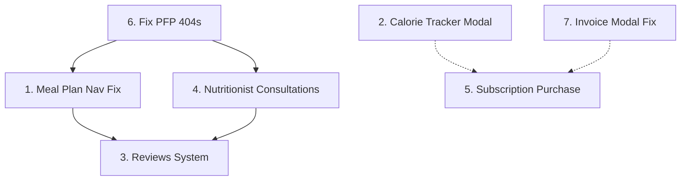

# Implementation Plan — 7 Frontend Features

> Based on [prompt.md](file:///c:/Users/akram/thesis_project/personalized-dietary-platform/frontend/prompt.md) requirements and current codebase analysis.

---

## Feature 1 — Fix Meal Plan Navigation & Day Content Rendering

**Problem:** The "Next Day" button both navigates AND marks the day as done. Day shows `NaN`, meals render empty, snacks/instructions are missing. The API response shape (`breakfast`, `lunch`, `dinner`, `snacks` as objects, `instructions` as string) doesn't match what the UI expects.

**Files to modify:**
- [meal-plans/[id]/page.tsx](file:///c:/Users/akram/thesis_project/personalized-dietary-platform/frontend/src/app/%28dashboards%29/client/meal-plans/%5Bid%5D/page.tsx)
- [client/service.ts](file:///c:/Users/akram/thesis_project/personalized-dietary-platform/frontend/src/lib/client/service.ts)

### Steps

| # | Task | File | Details |
|---|------|------|---------|
| 1 | **Add typed interface for day content** | `client/service.ts` | Add `MealPlanDayContent` interface matching the API: `{ day_index, breakfast: {name,notes,calories,ingredients[]}, lunch:{...}, dinner:{...}, snacks:{...}, instructions }`. Note: `snacks` is a **single object** (not array) per the example response. |
| 2 | **Add service function** | `client/service.ts` | `getMealPlanDayContent(userPlanId: number, dayIndex?: number)` → `GET /client/user-plans/{id}/content/` with optional `?day_index=N` param. Also add `advanceMealPlanDay(userPlanId: number)` → `PATCH /client/user-plans/{id}/advance/`. |
| 3 | **Separate navigation from marking done** | `[id]/page.tsx` | Add **Previous/Next navigation buttons** that pass `?day_index=N` to the content endpoint (no advance call). Add a separate **"Mark Day Complete"** button that calls `advanceMealPlanDay()`. |
| 4 | **Fix `day_index` display** | `[id]/page.tsx` | Use `content.data.day_index` (API wraps in `{status, data}`). Currently `content.day_index` is `undefined` → `NaN`. Unwrap the response properly. |
| 5 | **Fix meal cards** | `[id]/page.tsx` | Render `content.data.breakfast.name`, `.notes`, `.calories`, `.ingredients`. Snacks is a single object, not an array — render it as a 4th card alongside breakfast/lunch/dinner. Show `content.data.instructions` in the notes card. |
| 6 | **Track viewed day vs current day** | `[id]/page.tsx` | Add `viewingDayIndex` state separate from the plan's `current_day_index`. Disable "Mark Complete" unless viewing the current day. |

---

## Feature 2 — AI Calorie Tracker Disclaimer + Result Modal Enhancements

**Problem:** No AI approximation disclaimer. The AI result modal doesn't show estimated totals (calories, protein, fats, carbs) alongside detected items. Adding/removing ingredients doesn't trigger recalculation in the modal.

**Files to modify:**
- [calorie-tracker/page.tsx](file:///c:/Users/akram/thesis_project/personalized-dietary-platform/frontend/src/app/%28dashboards%29/client/calorie-tracker/page.tsx)

### Steps

| # | Task | Details |
|---|------|---------|
| 1 | **Add AI disclaimer banner** | Add a visible warning/info banner on the AI tab and inside the review modal: *"⚠️ AI estimates are approximations. Actual nutritional values may vary. Review and adjust items before saving."* Use `AlertTriangle` icon with amber styling. |
| 2 | **Show nutrition preview in modal** | The `AICalorieLog` response already has `nutrition_preview?: { total_calories, total_protein, total_carbs, total_fats }`. Display these values in a summary row at the top of the modal. |
| 3 | **Add local recalculation state** | Add `estimatedNutrition` state. Initialize it from `nutrition_preview`. When the user adds/removes/edits an ingredient, call a local recalculation function (or re-submit `user_final_log` to the confirm endpoint in preview mode if supported). Simplest approach: use the per-item `calories` field to sum totals locally, or show a "totals will be recalculated on save" note. |
| 4 | **Show per-item nutrition** | Each `EditablePrediction` already has `calories`. Display protein/fats/carbs if available from predictions. |

---

## Feature 3 — Reviews for Plans & Consultations (Client Side)

**Problem:** No review submission UI exists. Clients need to review purchased plans and finished consultations.

**Files to modify:**
- [client/meal-plans/page.tsx](file:///c:/Users/akram/thesis_project/personalized-dietary-platform/frontend/src/app/%28dashboards%29/client/meal-plans/page.tsx)
- [client/consultations/page.tsx](file:///c:/Users/akram/thesis_project/personalized-dietary-platform/frontend/src/app/%28dashboards%29/client/consultations/page.tsx)
- [client/service.ts](file:///c:/Users/akram/thesis_project/personalized-dietary-platform/frontend/src/lib/client/service.ts)

### Steps

| # | Task | File | Details |
|---|------|------|---------|
| 1 | **Add review API types & function** | `client/service.ts` | Add `ReviewPayload { item_type: "plan"\|"consultation", item_id: number, rating: number, comment?: string }` and `postReview(payload)` → `POST /reviews/`. |
| 2 | **Create `ReviewModal` component** | New: `components/ReviewModal.tsx` | Reusable modal with star rating (1-5 clickable stars), optional comment textarea, submit button. Props: `isOpen, onClose, itemType, itemId, onSuccess`. |
| 3 | **Add "Leave Review" to meal plans** | `meal-plans/page.tsx` | On each plan card (especially completed ones), add a "Review" button that opens the `ReviewModal` with `item_type="plan"` and `item_id=userPlan.plan_id`. |
| 4 | **Add "Leave Review" to consultations** | `consultations/page.tsx` | On consultation cards with `status === "finished"`, add a "Review" button that opens `ReviewModal` with `item_type="consultation"` and `item_id=c.id`. |

---

## Feature 4 — Nutritionist Consultation Management (Zoom Link + Status)

**Problem:** The nutritionist consultations page has a zoom link input but no "Mark as Done" button and no status update flow. Buttons should be disabled for finished/cancelled consultations.

**Files to modify:**
- [nutritionist/consultations/page.tsx](file:///c:/Users/akram/thesis_project/personalized-dietary-platform/frontend/src/app/%28dashboards%29/nutritionist/consultations/page.tsx)
- [nutritionist/service.ts](file:///c:/Users/akram/thesis_project/personalized-dietary-platform/frontend/src/lib/nutritionist/service.ts) (already has `patchConsultationStatus`)

### Steps

| # | Task | Details |
|---|------|---------|
| 1 | **Add "Mark as Finished" button** | In the consultation workspace modal, add a button calling `patchConsultationStatus(id, "finished")`. Update local state to reflect the new status. |
| 2 | **Add "Cancel" button** | Similar button calling `patchConsultationStatus(id, "cancelled")` with a confirmation dialog. |
| 3 | **Disable controls conditionally** | Disable the Zoom link input + "Update & Notify" button + "Mark as Finished" if `status !== "scheduled"`. Only show relevant actions per status. |
| 4 | **Add status filter tabs** | Add filter tabs/buttons at the top: All / Scheduled / Finished / Cancelled. Filter the table rows accordingly using the `?status=` query param or client-side filtering. |
| 5 | **Show zoom link on client side** | In [client/consultations/page.tsx](file:///c:/Users/akram/thesis_project/personalized-dietary-platform/frontend/src/app/%28dashboards%29/client/consultations/page.tsx) — already implemented (line 187). Verify it works with real API data by removing mock fallback and using `getClientConsultations()` from `client/service.ts`. |

---

## Feature 5 — Integrate Subscription Purchase Endpoint

**Problem:** The subscription page buttons ("Get Monthly Pro", "Get Yearly Pro") are non-functional — they don't call any API.

**Files to modify:**
- [subscription/subscription.tsx](file:///c:/Users/akram/thesis_project/personalized-dietary-platform/frontend/src/components/subscription/subscription.tsx)
- [client/service.ts](file:///c:/Users/akram/thesis_project/personalized-dietary-platform/frontend/src/lib/client/service.ts)

### Steps

| # | Task | File | Details |
|---|------|------|---------|
| 1 | **Add purchase API function** | `client/service.ts` | Add `SubscriptionPurchasePayload { plan_type: "monthly"\|"yearly", amount_paid: number, transaction_number: string }` and `purchaseSubscription(payload)` → `POST /lookup/client/subscriptions/purchase/`. |
| 2 | **Add simulated payment modal** | `subscription.tsx` | Create a checkout modal that appears when clicking "Get Monthly Pro" or "Get Yearly Pro". Show plan summary, generate a simulated `transaction_number` (e.g. `TXN-{timestamp}`), display the `amount_paid` ($19 monthly / $190 yearly), and a "Confirm Payment" button. |
| 3 | **Wire button clicks** | `subscription.tsx` | Monthly button → opens modal with `plan_type: "monthly", amount_paid: 19`. Yearly → `plan_type: "yearly", amount_paid: 190`. On confirm, call `purchaseSubscription()`. |
| 4 | **Handle success/error** | `subscription.tsx` | On success: show a success toast/banner with subscription details (start/end dates). Optionally redirect to dashboard. On error: show error message. |

---

## Feature 6 — Fix Profile Photo 404s Across All Dashboards

**Problem:** Profile photos return 404 because the URL from the API is a relative path (e.g. `/media/photos/pic.jpg`) that gets routed through Next.js instead of the Django backend.

**Files to modify:**
- [UserProfileDropdown.tsx](file:///c:/Users/akram/thesis_project/personalized-dietary-platform/frontend/src/components/dashboard/shared/UserProfileDropdown.tsx)
- [profile.ts](file:///c:/Users/akram/thesis_project/personalized-dietary-platform/frontend/src/lib/profile.ts)
- [NutritionistProfileModal.tsx](file:///c:/Users/akram/thesis_project/personalized-dietary-platform/frontend/src/components/NutritionistProfileModal.tsx)
- [nutritionist/profile/page.tsx](file:///c:/Users/akram/thesis_project/personalized-dietary-platform/frontend/src/app/%28dashboards%29/nutritionist/profile/page.tsx)
- [client/service.ts](file:///c:/Users/akram/thesis_project/personalized-dietary-platform/frontend/src/lib/client/service.ts)
- [nutritionist/service.ts](file:///c:/Users/akram/thesis_project/personalized-dietary-platform/frontend/src/lib/nutritionist/service.ts)

### Root Cause

`resolveApiUrl()` in [api.ts](file:///c:/Users/akram/thesis_project/personalized-dietary-platform/frontend/src/lib/api.ts#L19-L26) already correctly prepends the backend origin. The issue is that **not all consumers pass URLs through `resolveApiUrl()`**.

### Steps

| # | Task | Details |
|---|------|---------|
| 1 | **Audit all `profile_photo_url` usages** | Ensure every place that reads `profile_photo_url` passes it through `resolveApiUrl()` before rendering in `` or `<AvatarImage>`. |
| 2 | **Fix `profile.ts`** | `getProfileIdentity()` already calls `resolveApiUrl()` ✅. Verify the returned `avatarUrl` is being passed correctly to `UserProfileDropdown`. |
| 3 | **Fix `UserProfileDropdown`** | The `user.avatarUrl` prop is passed directly to `<AvatarImage src={user.avatarUrl}>`. Check that the parent layout component is passing the resolved URL from `getProfileIdentity()`. |
| 4 | **Fix nutritionist profile page** | Line 48: `resolveApiUrl(profile.profile_photo_url)` ✅ already done. Verify this works. |
| 5 | **Fix `NutritionistProfileModal`** | Line 72-73: Already uses `resolveApiUrl()` ✅. |
| 6 | **Check client profile page** | Verify the client profile page also uses `resolveApiUrl()` for the photo. |
| 7 | **Test with real backend** | Confirm that `http://127.0.0.1:8000/media/photos/pic.jpg` resolves correctly. |

---

## Feature 7 — Fix Invoice Details Modal Layout

**Problem:** The invoice detail modal has layout issues — duplicate "Client" fields (lines 272-278 AND 320-327), missing nutritionist info, and missing the total amount display prominently.

**Files to modify:**
- [client/Invoice/page.tsx](file:///c:/Users/akram/thesis_project/personalized-dietary-platform/frontend/src/app/%28dashboards%29/client/Invoice/page.tsx)

### Steps

| # | Task | Details |
|---|------|---------|
| 1 | **Remove duplicate Client field** | Remove the standalone "Client" block at lines 272-278 (it's duplicated in the grid at lines 320-327). |
| 2 | **Add prominent total amount** | Add a large, styled total amount display at the top of the modal body: `$XX.XX` with a "Total Paid" label. Use large font, primary color. |
| 3 | **Replace second "Client" with "Nutritionist"** | In the grid (lines 320-327), change the second "Client" cell to show `@{invoiceDetail.nutritionist_username}` with label "Nutritionist". |
| 4 | **Add commission/net earnings** | If `net_earnings` and `commission_rate` are present, show them in a financial breakdown section below the grid. |
| 5 | **Improve overall layout** | Ensure the modal has a clear visual hierarchy: Header → Total Paid → Details Grid (Reference, Date, Service Type, Nutritionist) → Financial Breakdown → Actions. |

---

## Dependency / Execution Order

> [!TIP]
> **Recommended order:** 6 → 7 → 2 → 1 → 5 → 4 → 3
> Start with quick fixes (6, 7, 2) before the more involved features (1, 4, 3, 5).

---

## Summary Table

| # | Feature | Complexity | New Files | Modified Files |
|---|---------|-----------|-----------|----------------|
| 1 | Meal Plan Nav & Content | 🔴 High | 0 | 2 |
| 2 | AI Calorie Disclaimer + Modal | 🟡 Medium | 0 | 1 |
| 3 | Reviews (Plans & Consultations) | 🟡 Medium | 1 (`ReviewModal`) | 3 |
| 4 | Nutritionist Consultation Mgmt | 🟡 Medium | 0 | 2 |
| 5 | Subscription Purchase | 🟡 Medium | 0 | 2 |
| 6 | Fix Profile Photo 404s | 🟢 Low | 0 | 3-5 |
| 7 | Fix Invoice Modal Layout | 🟢 Low | 0 | 1 |
